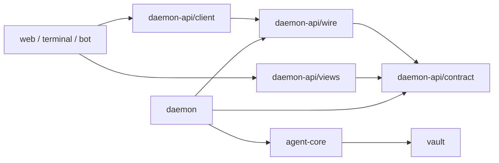

# Daemon API: a contract for views

Status: **design draft; implementation is not yet conformant**. The target is
API version 1. This document defines the boundary between an Estoc daemon and
its web, terminal and programmatic clients, called **views**. It defines the
public data model, session behaviour and transport obligations; it does not
change the [vault model](replica-model/README.md), event identity, admission,
continuity, dispatch authority or portable backup format.

The capitalized requirement words have their BCP 14 meanings. The TypeScript
shapes describe public data, not imports from the current implementation.
Normative rules apply equally to an embedded daemon and an attached one.

This is a temporary design and implementation handoff, not a second source
of truth to maintain beside the code. The lasting contract belongs in public
types, executable schemas, explicit program structure and focused behavioural
tests. Comments retain only reasons and constraints those cannot express,
without depending on this document's names or section numbers. Once the
contract is implemented and verified there, this draft is removed.

## 1. Responsibilities and trust

A daemon owns one vault, its unlocked keys, domain procedures and read
projections. A view renders records and requests named operations. Only the
daemon reads or changes the live vault; a view MUST NOT open its SQLite file,
compose vault events or infer permission to send from presentation state.

The daemon decides which observations are admitted, what continuity is
verified, which channels are eligible for a send and which work remains.
These decisions are rechecked when an operation executes. A view decides
layout, navigation, grouping by date, localization, drafts and scroll position.
The same vault state can support different screens without changing facts or
granting different authority.

For a new projection, disagreement about a fact or permitted action belongs
in the daemon: two views must not produce conflicting answers from the same
evidence and policy. Choices that only change how those facts are presented
belong in the view.

Normal API records and replies MUST NOT contain plaintext seeds, private
keys, keystore handles or runtime objects. Portable backups are an explicit
exception to the record boundary: they contain raw events, retained content
and the encrypted seed wrapper required by the
[export contract](replica-model/vault-sqlite.md#snapshot-and-export).
Their history is plaintext; the passphrase protects the seed wrapper only.

A token authorizes the entire daemon interface. A view holding it is a
trusted client, not a sandboxed renderer. A view that handles a passphrase
and a backup can disclose material sufficient to recover the identity.
Neither a worker boundary nor the absence of a plaintext-seed method prevents
that disclosure. Views MUST keep passphrases out of persistent storage and
logs, and keep tokens in private storage. Backup delivery is an intentional
release of recovery material to the person or their chosen program.

## 2. Packages and type ownership

`@estoc/daemon-api` is the public package a view installs. It has four entry
points in one package:

| Entry point | Owns |
| --- | --- |
| `/contract` | Public identifiers, records, method inputs/results, events, stable error codes, runtime schemas and API version |
| `/client` | The typed proxy, negotiation, attachment, pending calls and local connection state |
| `/wire` | Framing, validation, encoding, port adapters and the server dispatcher over an explicit public handler table |
| `/views` | Pure record lookup, navigation helpers and invitation/message helpers usable without a daemon runtime |

`/wire` is shared by the client and daemon; the daemon does not import a
client session to serve requests. These are entry points of one package,
not separate packages with separate release cycles.

The following arrows mean source dependencies, not network calls:



`vault` and `agent-core` retain their domain types and MUST NOT depend on
`daemon-api`. The daemon adapts their results into API-owned data transfer
objects (DTOs). Public records MUST NOT be aliases, re-exports or declaration
references to backend types. Similar fields may have separate declarations;
the adapter, schemas and conformance cases keep their meanings aligned.
An internal refactor does not by itself change the public API.

Public IDs are opaque strings with documented roles. API declarations MAY
brand them for TypeScript callers, independently of backend brands. A brand
is not validation or authority. The adapter preserves validated domain ID
spellings; request decoding checks syntax, and the domain procedure checks
existence, ownership and current eligibility. Views compare and return IDs;
they do not reconstruct event or execution IDs.

Installing the API package MUST suffice to compile and run a view without
installing the daemon, vault, event store, DIDComm WASM or keystore. Its
dependencies MAY include small portable validation or encoding libraries.
There is no requirement to reimplement a standard algorithm to achieve zero
dependencies. The contract and pure helpers perform no filesystem, network
or cryptographic identity operation. Client adapters acquire platform
resources only when explicitly constructed.

First-party view code imports only the API entry points for this boundary.
The host that embeds the daemon is separate: a browser worker or Node host
may import `@estoc/daemon` and its runtime dependencies. The host contract
remains owned by `@estoc/daemon`; it is not part of the public client package.

## 3. Host lifecycle, vault state and connection state

### 3.1 The host owns startup

The host creates and starts the daemon independently of whether any view is
attached. Startup begins in `booting`, publishes progress and may wait in
`elsewhere` while another runtime holds the files. An endpoint can answer
negotiation and attachment during that wait. Taking and releasing the files
obeys [exclusive ownership](replica-model/vault-sqlite.md#ownership-and-lifecycle).

There is no public `boot()` or host `close()` RPC. Opening another view does
not start another agent. Detaching or losing the last attached view does not
lock the vault or stop the daemon. An embedding host may shut down with its
own page or worker; that is a host lifetime decision.

The host's close operation stops accepting work, quiesces ongoing domain
operations under their existing deadline and ownership rules, closes the
files and then releases their ownership. Dropping a client's socket alone
does not cancel an operation already admitted to execution.

### 3.2 State is one value

```ts
type Hold = string;
type Epoch = string;
type Revision = number;

type StateValue =
  | { phase: "booting" | "unreadable"; hold: Hold | null; detail: string | null }
  | { phase: "elsewhere" | "onboarding" | "foreign"; hold: null; detail: string | null }
  | { phase: "damaged" | "locked"; hold: Hold; detail: string | null }
  | { phase: "open"; hold: Hold; snapshot: Snapshot };

interface State {
  epoch: Epoch;
  revision: Revision;
  value: StateValue;
}
```

`state(State)` replaces the entire previous value. It replaces the separate
`phase`, `opened` and `changed` events. A non-open value contains no snapshot;
a view MUST remove its live snapshot and all derived live records when it
receives one. A view MUST NOT manufacture an open state from a successful
unlock reply or optimistically patch a snapshot after a command.

| Phase | Meaning and available recourse |
| --- | --- |
| `booting` | Startup is in progress; no vault operation is ready yet |
| `elsewhere` | Another runtime owns the files; this daemon waits and refuses file mutations |
| `onboarding` | The daemon owns the location and no vault stands there; create or restore is available |
| `foreign` | The host found an incompatible layout; the daemon takes and removes nothing; recourse belongs to the host |
| `unreadable` | The vault or location could not be opened; removal is available only with a non-null hold on a vault file |
| `damaged` | Valid-version history is damaged; ordinary writes stop; recovery restores a validated backup into a new vault |
| `locked` | The daemon holds the vault without unlocked identity use; unlock or explicitly guarded removal is available |
| `open` | A complete snapshot is available; operations still check their own preconditions |

`detail` explains the condition to a person and is not a branch key.
`damaged` must explain that only history in a usable backup returns, and
that the seed alone cannot recover missing history. No phase promises a
backup can be exported from an unreadable or damaged runtime.

`booting` covers both acquisition and opening checks. Its hold is null until
a particular vault file is held, and non-null if opening that held file is
still in progress. `elsewhere`, `onboarding` and `foreign` always have null
holds; `damaged`, `locked` and `open` always name a held file. `unreadable`
names a hold only when the failed open still leaves that file in this
daemon's ownership. Holding the location alone does not create a file hold.

`hold` names the particular vault file held by this daemon. It is stable
through lock/unlock and other phases while that file remains held, and is
retired when it is removed or released. A new daemon ownership period or a
replacement file gets a new hold even if its anchor is the same. It is not
a portable vault ID or a capability token. `forgetIdentity({ hold })` MUST
compare the caller's captured hold under the lifecycle exclusion that also
removes the file. A stale confirmation MUST NOT remove a replacement vault.

Removal is allowed in `open`, `locked`, `damaged`, and `unreadable` with a
non-null hold. Other phases, or no held file, return `WrongPhase`; an allowed
phase with a different hold returns `StaleHold`. These checks happen before
stopping the runtime or changing the file.

### 3.3 Connection state is local to the client

The client exposes `connecting`, `connected`, `disconnected` or
`incompatible`, separately from the last daemon state. `connected` means
negotiation and initial attachment have completed, not merely that a socket
is open. `unreachable` is therefore not a daemon phase.

On disconnection a view MAY retain its last display, marked stale. The SDK
MUST reject new application calls with a client `NotConnected` error until
a fresh attachment completes; connection and attachment traffic itself is
exempt from that guard. On reconnection it replaces the old state before
enabling operations. Callbacks
from an older socket or worker connection MUST NOT update the new session.
A daemon-originated non-open state still clears the snapshot; a stale display
is not permission to retain live records after a received lock transition.

## 4. Negotiation and attachment

Every port begins with a bootstrap exchange. These JSON record shapes and
their meaning remain stable across application API versions:

```ts
type Hello = { kind: "hello"; wire: 1; apis: number[] };
type Welcome = {
  kind: "welcome";
  wire: 1;
  api: number;
  implementation: string;
  limits: {
    maxFrameBytes: number | null;
    maxBackupBytes: number;
    maxValueBytes: number;
    maxDepth: number;
  };
};
type Incompatible = {
  kind: "incompatible";
  wire: 1;
  supported: number[];
  message: string;
};
```

The daemon speaks one application API version and selects it only if it is
in `apis`; otherwise it returns `incompatible` and closes the port. A view
MUST NOT continue after a mismatch. Implementation text is informational.
No records, runtime lines, logs or public method calls precede successful
negotiation. Each new physical connection negotiates again. The daemon must
answer the bootstrap in every phase without waiting for file ownership.

After `welcome`, the client calls `attach()`. The daemon registers that
port and queues one result containing `{ state: State, lines: LinesState }`
as a single ordered publication step. That result is the session's initial
baseline. Subsequent events follow it on the port; events already represented
by the baseline are not replayed behind it. There is no application-visible
read-then-subscribe gap and no independent snapshot read for each new view.
The baseline's state and lines must belong to the same epoch.

Attachment uses the current complete published state, which may be `booting`
or `elsewhere`. If a commit is not represented yet, the publisher's scheduled
update follows. A port attaches once; a second call returns `AlreadyAttached`.
Other public methods before attachment return `NotAttached`. Closing the
port unregisters only that session. Existing views receive no replay because
another one joined.

The server exposes an explicit method table. Host operations, prototype
methods and internal helpers never become callable through object spreading
or reflection. Unknown method names return `NoSuchMethod`.

## 5. Publishing state

### 5.1 Epochs, revisions and coherent reads

One publisher owns state ordering for all views. It installs a fresh opaque
epoch on daemon startup and whenever `(phase, hold)` changes. Revisions are
positive safe integers, beginning at 1 in each epoch. Epochs are unequal
tokens, not sortable clocks; revisions compare only within one epoch. Neither
is a vault event CID, receipt ordinal, portable identity or durable cursor.
An implementation installs a fresh epoch before exhausting its revision range.

The publisher MUST satisfy all of these invariants:

1. A snapshot describes one coherent read of domain events, retained content
   and the local options affecting the view, including the restore gate.
2. Within an epoch, a later revision never represents an older read cut.
   Reusing a revision means exactly the same state value.
3. A change of epoch invalidates every unfinished build from the old epoch.
   Such a build cannot publish after the transition, even if it finishes later.
4. Each attached port sees its initial baseline followed by increasing
   revisions of that epoch, or a new epoch's complete state. Intermediate
   revisions may be coalesced. Old-epoch state never follows a new epoch.

These invariants can be implemented by serializing capture and publication
or by using an immutable pinned read cut. Neither strategy is required.
Attachment and lifecycle transitions obey the same ordering: mixing events,
content or erasure state from different cuts is not a coherent snapshot,
and assigning a larger revision to a stale result cannot make it current.

### 5.2 Automatic updates and coalescing

Every committed change that can affect public records MUST invalidate the
projection and schedule publication. This includes user commands, inbound
receipt/admission, dispatch completion, background recovery, import, content
repair/erasure and relevant local options. Failed calls that committed
something also invalidate it.

The daemon MAY combine several commits into one complete snapshot. It MUST
make publication progress while changes continue, and changes during a
capture cannot be lost. Once writes quiesce, a healthy connected view
eventually receives a state covering all of them without a call to
`refresh()` or a visibility event.

Command replies report the procedure's result, independently of when a view
renders the corresponding state. Views MUST NOT infer rollback from an
error or assume a reply is the next snapshot.

The `refresh` RPC returns the `{ epoch, revision }` of a state covering all
projection changes committed before that request's execution. If no such
change remains unpublished, it reuses the current published revision without
another capture or a new state event. The calling port's baseline or an
earlier update already supplies that state, either received or queued.
Otherwise, the daemon captures a fresh state and queues it, or a newer state
of the same epoch, before the reply. Coalescing may substitute a greater
revision of the same epoch but must keep the qualifying state ahead of the
reply. If the epoch changes before the qualifying state and reply are
queued, the RPC fails with `StateChanged`.

The SDK's `refresh(): Promise<void>` resolves only after receiving a matching
RPC result and consuming a state of that epoch whose revision is **greater
than or equal to** the returned revision. It includes states already
received when the reply arrives; it never waits for an exact revision or
requires a new event after the reply. For example, revision 8 satisfies a
target of 7 even if 7 was coalesced away. If the SDK moves to another epoch
before satisfying the barrier, it rejects with `StateChanged`; a closed
connection rejects under the disconnection rules. Views use this operation
without implementing their own revision wait. Success does not freeze the
state against later changes.

### 5.3 Runtime lines and logs

`lines` is a complete replacement of the agent's transient connection,
waiting-delivery and bounded-discard diagnostics. It is not vault history.

```ts
interface Lines {
  connections: ConnectionRecord[];
  waiting: WaitingDeliveryRecord[];
  discarded: DiscardRecord[];
}

interface LinesState {
  epoch: Epoch;
  revision: Revision;
  value: Lines;
}

interface LogLine {
  epoch: Epoch;
  line: string;
}
```

Connection records retain mediation identity, live/unreachable status,
reconciliation and drain results, and bounded unknown registrations. Waiting
records retain their delivery key, pickup/direct source, reason and whether
bytes are held for retry. Discard records retain source and reason, without
envelope bytes. These are API-owned records, not exported agent types.

Lines have their own revision counter, starting at 1 in every state epoch.
They belong to the current state epoch and their three lists are empty in
non-open phases. An epoch transition initializes its lines before a port can
attach, queues the new state before that epoch's lines, clears the prior
lines, and invalidates old agent callbacks. An attached view MUST NOT apply
lines from another epoch.
Changes in runtime lines publish automatically without rebuilding the vault
snapshot. Updating state and lines is not a cross-stream atomic observation.

`log(LogLine)` appends a display line with its epoch. It has no authority,
is not an audit log and has no replay guarantee. A session's logs cannot
precede its initial baseline or arrive from a retired epoch. Views own
bounded log buffers; no application decision depends on receiving every line.

Each port has bounded output buffering. A slow view cannot delay the agent,
the writer lock or other views. The daemon may replace an unsent state or
lines update with a newer complete value of the same epoch. It MUST preserve
attachment baselines, epoch transitions and RPC replies; it may drop logs.
If these obligations no longer fit its buffer limit, it closes that port.
The daemon's own memory and queue guards are implementation resource limits,
not the advertised request bounds. Exceeding an advertised request bound
does not disqualify a state, its attachment baseline or any other publication.
If the platform cannot construct or encode the complete state, or a coherent
read fails, the daemon sends a terminal `StateUnavailable` fault instead of
an incomplete snapshot. This does not relabel a healthy vault as `damaged`.

## 6. Public records and projections

### 6.1 One copy of each record

The snapshot is normalized within one complete value. Normalization does not
introduce diffs, subscriptions to individual records or cross-snapshot caches.

```ts
type ChannelId = string;
type DisplayTime = string;

interface Snapshot {
  anchor: string;
  label: string;
  restoreUnexplained: boolean;
  mediations: MediationRecord[];
  dids: LocalDidRecord[];
  contacts: ContactRecord[];
  channels: ChannelRecord[];
  messages: MessageRecord[];
  observations: ObservationRecord[];
  conversations: ConversationRecord[];
  invitations: InvitationRecord[];
  pending: PendingWork;
  unplaced: UnplacedRecord;
}

interface UnplacedRecord {
  observationIds: string[];
  outputs: { messageId: string; candidateChannelIds: ChannelId[] }[];
}

interface ConversationRecord {
  id: string;
  contactId: string | null;
  petname: string | null;
  claimedName: { name: string; messageId: string } | null;
  channels: { channelId: ChannelId; selected: boolean }[];
  writeTo: ChannelId[];
  defaultWriteTo: ChannelId | null;
  messageIds: string[];
  unadmittedObservationIds: string[];
  diagnostics: string[];
}
```

The API owns complete schemas for every named DTO above. The record inventory
fixes the public information to preserve and the normalization to apply:

| Record | Public information |
| --- | --- |
| `MediationRecord` | `mediationId`, mediator DID, selection, usability, retirement and diagnostics |
| `LocalDidRecord` | `didId`, canonical DID, liveness, retirement, disclosure and diagnostics |
| `ContactRecord` | `contactId`, origin, flags and saved DID preference; one record per undeleted contact |
| `ChannelRecord` | `channelId`, canonical `localDid` and `peerDid`, nullable `headChannelId`, superseded/blocked/conflicted state, send gate, sourced peer name claim, submitted-profile ID, message and observation reference lists |
| `MessageRecord` | `messageId`, direction, nullable `channelId`, exact selecting contact IDs, display time `at: DisplayTime`, agreed headers, body availability/content/attachments, protocol kind, effect type, execution/delivery status, ACK/late/verification state, available manual steps, diagnostics and summary |
| `ObservationRecord` | `sourceEventCid`, logical `messageId`, nullable `channelId`, `at: DisplayTime`, authentication/verification state, admission disposition and contradiction indicator; no message body |
| `InvitationRecord` | Disclosure CID, OOB ID, local DID entity/string, use policy, availability and consumer |
| `PendingWork` | Pending outbounds, missing responses/notifications, notification conflicts and waiting proofs, retaining the IDs and explicit manual entries needed to act on each |
| `UnplacedRecord` | Unplaced observation references and output message references with their candidate channel IDs |

Each contact record has exactly one contact conversation, whose non-null
`contactId` resolves to that record. Petname, shown channels, send choices
and diagnostics live only in that conversation; the contact record retains
the remaining metadata.
`/views` helpers join the two without creating a second authoritative copy.

Conversation and channel DTOs contain references rather than embedded message,
observation or channel records. `messages` has one record per `messageId`,
`observations` one per `sourceEventCid`, and `channels` one per canonical
pair. Messages include admitted inputs and placed or unplaced outputs;
an unadmitted observation MUST NOT cause a placeholder accepted message.
Bodies and attachments appear only in their owning message record.

Attachments expose API-owned descriptors with metadata and content
references. Version 1 has no object-payload download operation and does not
promise that a view can open an attachment's bytes. A descriptor or body
availability does not imply payload availability; views present the metadata
without advertising unsupported opening or download actions. Adding object
retrieval requires its own contract, not direct access to the live vault.

`ChannelId` is the canonical JSON text of `[localDid, peerDid]` under the
[channel identity rule](replica-model/channels.md#channel-identity).
The daemon constructs it; views treat it as opaque. All channel references,
command targets and command results use this ID, not a pair object. The DID
fields on `ChannelRecord` describe its endpoints and are not an alternative
target encoding. The channel table includes every pair referenced
by contact membership, message/observation placement, heads, send choices
and unplaced-output candidates, even when a pair has no messages.

Relationship lists MUST resolve within the same snapshot: conversation and
channel `messageIds` resolve in `messages`, observation lists in
`observations`, and channel references in `channels`. In contrast, a logical
`messageId` carried by an unadmitted observation or pending proof names a
domain entity and need not have an accepted MessageRecord. Normalization
MUST NOT manufacture facts just to fill such references.

`DisplayTime` is a string naming a valid Gregorian UTC instant in exactly
`YYYY-MM-DDTHH:mm:ss.sssZ`, with seconds from 00 to 59 and three fractional
digits. The schema validates the date as well as the spelling. An observation
uses its source event's `at`; an inbound message uses the admitted source
observation chosen by the domain display projection; an outbound uses the
earliest `at` among its intents. These values preserve the source event
format, not a peer's header time or a view's localized time. Views localize
only for presentation and never feed the localized value back into ordering.

The arrays of records sort by their primary IDs using literal string
comparison. Message reference lists sort by ascending `(at, messageId)`;
observation reference lists sort by ascending `(at, sourceEventCid)`.
The fixed UTC format makes the time component's lexical order chronological.
These are deterministic presentation orders, not arrival order, causality
or authority. Equal timestamps do not leave iteration order as a tie-break.

### 6.2 Conversations

The daemon builds the default conversation projection as a pure derivation
over the captured read model. It follows
[contact views](replica-model/channels.md#display-relationships) and
[send selection](replica-model/channels.md#fixed-outbound-channel):

1. Each undeleted contact has one conversation. Its ID is `contact:` followed
   by the contact ID. It shows every channel in that contact's derived view,
   including related history, preserving each `selected` flag. Its send
   choices, preference result and diagnostics are the contact's domain
   results. A display-only contact-merge hint does not merge these records.
2. Mark every channel **shown** by any contact conversation as assigned,
   including channels with `selected: false`. Group remaining channels by
   `headChannelId ?? channelId`. Each group has a conversation whose ID is
   `channel:` followed by that key, with null contact and petname.
3. A nameless group writes only to its head when that head is a member of
   the group and its send gate is open. Otherwise its `writeTo` is empty and
   `defaultWriteTo` is null. It never falls back to a superseded predecessor.
4. A conversation's messages are the union of its shown channels' message
   references, each once in the defined display order. Its unadmitted list
   similarly unions observations whose disposition is not `admitted`.

For example, a contact selecting H while showing predecessor P through
verified continuity contains both `{H, selected: true}` and
`{P, selected: false}`. P does not also become a nameless conversation merely
because it is not selected. If two contacts show P, both may reference its
history; the underlying records still occur once in the snapshot.

A channel's peer name is a claim derived under the supported profile
protocol from effectively admitted, consistent source evidence. It retains
the claiming message ID. For a conversation, take these non-null channel
claims and select the largest `(claiming MessageRecord.at, messageId)` by
literal string comparison of the canonical UTC time, then message ID. A
candidate must resolve to an available claiming message in its source
channel. No candidates means null. Erased or missing
content supplies no name. With two claims at the same time, the greater
message ID wins; IDs otherwise express no chronology. A claim never renames
a contact or establishes a relationship.

Conversation IDs are projection keys, not saved chain identities. A nameless
key can change after rotation or naming. `/views` provides `successorOf`:
for snapshots with the same anchor, collect the old conversation's channel
IDs and find new conversations sharing any of them. Return the sole match,
otherwise null, including when there are no matches. A view first retains
an existing conversation ID when it still exists. This helper preserves
navigation only; it does not move drafts automatically or authorize a send.

### 6.3 Presentation helpers

`MessageRecord.summary` is a nullable fallback string derived from available
content by a handler for that message type. An unknown type, unavailable body
or conflicting interpretation yields null. A basic message supplies its
string content; a profile supplies `name: ` followed by its recognized name.
CRLF, CR, LF, U+2028 and U+2029 are replaced with spaces to form one line.
Renderers treat summaries and peer text as text, never executable markup or
terminal control instructions. Views choose localization and visual truncation.

The daemon remains responsible for admission and protocol interpretation.
Pure SDK helpers resolve IDs, assemble a selected conversation's records,
parse invitations and expose protocol constants used by commands. They MUST
NOT rescan events, reimplement continuity or decide send eligibility.
Views may organize multiple conversations differently while preserving each
message's source attribution and each operation's concrete target.

Drafts, selection, read markers and scroll positions remain view-owned,
namespaced by the vault anchor where they are per vault. Nothing in this
contract makes such UI state part of the portable vault history.

## 7. Commands, results and failures

### 7.1 Public operations

Operations use API-owned, named input objects. A method taking no arguments
receives `{}` on the wire. The initial inventory preserves these capabilities:

| Methods | Input and result responsibility |
| --- | --- |
| `attach`, `refresh` | Establish a baseline/subscription; synchronize the SDK's state through a publication barrier |
| `createIdentity` | Name and passphrase; create only in `onboarding` |
| `restoreIdentity` | Complete backup bytes and its passphrase; restore only into an unused destination |
| `unlock`, `lock` | Unlock with a passphrase; lock by stopping identity use and forgetting cached unlocked key material |
| `forgetIdentity` | Explicit captured `hold`; remove only that held vault file |
| `exportBackup`, `mergeBackup` | Deliver a complete validated portable file; import a same-anchor file and return added/duplicate/object/repair counts plus whether the local author was renewed |
| `explainedRestore` | Record that the person has received the required recovery explanation |
| `setMediator`, `createInvitation`, `acceptInvitation` | Configure mediation; create an OOB invitation under its use policy; accept one with a petname and return contact/message/channel identity plus the send result |
| `resolveChannel` | Validate/canonicalize explicit local/peer DIDs and return their `channelId` without creating history or granting send eligibility |
| `createContact`, `renameContact`, `setContactChannels` | Create or update explicit contact naming; channel selections are `channelIds: ChannelId[]` |
| `deleteContact`, `blockChannels`, `eraseMessage` | Apply deletion, denial/successor policy or erasure; `blockChannels` takes `channelIds: ChannelId[]`, without deriving broader targets from display grouping |
| `send`, `retry`, `cancel` | Submit a new intent to `{ channelId }` or `{ contactId }`; act on an existing message ID without retargeting it |
| `completeResponse`, `completeNotification`, `rotate` | Name the execution/effect or rotation decision; `rotate` selects its predecessor by `channelId`; return the procedure's result |
| `reconnect`, `traceLevel`, `setTraceLevel` | Reconnect mediator transports; read or set trace policy |

`reconnect` concerns the daemon's mediator connections, not the client's port.
Pending work is read from `Snapshot.pending`; a client needing a fresh cut
awaits `refresh()`. There is no separate `pending()` RPC. All clients,
including bots, attach before using operations. Trace levels are `off`,
`normal` and `verbose`. The initial API schemas must explicitly describe
every method's fields, nullability, result and known error codes before
version 1 is released; the inventory is not permission to forward arbitrary
backend arguments.

Channel inputs and results include these shapes:

```ts
type SendTarget = { channelId: ChannelId } | { contactId: string };
interface SendInput { target: SendTarget; content: Content }
interface ResolveChannelInput { localDid: string; peerDid: string }
interface ResolvedChannel { channelId: ChannelId }
interface CreateContactInput { petname: string; channelIds: ChannelId[] }
interface SetContactChannelsInput { contactId: string; channelIds: ChannelId[] }
interface BlockChannelsInput { channelIds: ChannelId[]; includeSuccessors: boolean }
interface RotateInput { channelId: ChannelId }
```

`resolveChannel` provides an ID for an explicitly supplied pair even if no
record of it has appeared in a snapshot. It only validates and canonicalizes
the supplied DID spellings under the domain rules; it does not fetch a
document, mint a DID, create a contact or authorize an operation. Returning
an ID does not insert a record into the snapshot. Commands decode IDs and
recheck their own domain requirements; prior snapshot membership is not an
additional requirement. `rotate` resolves the pair's local DID entity in the
current vault and refuses an absent or ambiguous eligible entity. Procedures
that create a relationship, including invitation acceptance, return its
`channelId` directly. Views never parse or construct channel IDs to bridge
one operation to another.

Requests operate on this daemon's vault. Views invalidate outstanding UI
actions when its hold changes, and destructive confirmations carry the hold
captured when shown. The SDK MUST NOT replace an explicit old hold with its
new current one. Per-vault entity IDs never grant authority in another vault.

File lifecycle operations are mutually exclusive and recheck phase, hold
and destination occupancy within that exclusion. They cannot close or remove
a runtime beneath an operation using it. Domain procedures retain their
operation-lock and per-message ordering rules. Concurrent calls may complete
out of order; the API does not promise that a whole network procedure is one
atomic transaction or impose a global FIFO of network waits across views.

When a snapshot says `restoreUnexplained`, the daemon MUST refuse user sends
and manual dispatch, including invitation acceptance and rotation paths that
send, until `explainedRestore` has committed. A view explains the restore
limitation before offering that call. Receiving, reconciliation and work the
runtime independently owes retain their domain rules. Likewise, `writeTo`,
manual-action lists and displayed send gates are hints for presenting actions;
the daemon revalidates every action against current evidence and policy.

### 7.2 Procedure outcomes are data

```ts
interface Outcome {
  outcome:
    | "submitted" | "pending" | "failed" | "uncertain" | "expired"
    | "spent" | "none" | "refused" | "existing" | "cancelled";
  because: string | null;
}

interface SendResult extends Outcome {
  messageId: string;
  channelId: ChannelId;
}
```

Each method's schema restricts this union to the outcomes it can return.
`submitted` means the transport acceptance the domain recorded, not a peer
application ACK. `pending` is deferred work; `none`, `refused`, `spent` and
`existing` retain their procedure-specific no-new-action meanings.
`failed` is a non-acceptance transport answer; `uncertain` is a transport
attempt whose arrival is unknown. `expired` and `cancelled` describe the
recorded termination. Unexpected exceptions are not procedure outcomes.
`because` is explanatory text. Clients branch on the outcome tag, not that text.

A normal result is distinct from an RPC failure. A view must surface the
actual outcome, including failure or uncertainty, rather than announce every
resolved promise as sent. A bot follows the same distinctions even without
a screen. A retry by message ID preserves the domain's existing package;
another `send` may create a new message and is not an equivalent retry.

### 7.3 Stable RPC errors

```ts
interface ApiError {
  code: string;
  message: string;
  effect: "none" | "possible";
  messageId: string | null;
}
```

`code` is protocol vocabulary independent of exception class names. `message`
is text for a person or log. `effect: "none"` may be reported only when the
daemon knows the requested operation caused no domain mutation or external
side effect; otherwise it reports `possible`. An exception after an earlier
commit is not a refusal with no effect. Error details contain no secret or
raw thrown object. Internal stacks stay on the host.

Unexpected execution failures use `OperationFailed` for every method,
including `send`, `acceptInvitation`, `rotate`, `retry` and completions.
There is no public `threw` outcome. An adapter translates an internal caught
exception result into this error rather than forwarding its internal tag.
Known refusals retain their specific codes; ordinary transport outcomes
such as `failed` and `uncertain` remain procedure data.

`messageId` is non-null only when the daemon can identify one relevant,
already recorded message in the operation's vault; a generated but uncommitted
ID or an unchecked input ID is insufficient. It is diagnostic context, not
proof of dispatch, a deduplication key or permission to retry. Its presence
does not change error classification or imply `effect: "none"`. Operations
with no such single known message return null. This rule applies regardless
of whether the successful method result would have contained a message ID.

The baseline daemon codes are:

| Code | Meaning |
| --- | --- |
| `NotAttached`, `AlreadyAttached` | Session precondition failed |
| `NoSuchMethod`, `InvalidArgument` | Unknown public method or invalid input; no method invocation |
| `WrongPhase`, `StaleHold`, `RestoreUnexplained` | A lifecycle or recovery guard refused the requested operation |
| `NoTarget`, `SendClosed` | Current contact selection or channel policy supplies no permitted target |
| `StateChanged` | A refresh barrier lost its epoch |
| `ResourceLimit` | The operation exceeds the advertised resource bounds |
| `OperationFailed` | An operation failed outside a normal procedure outcome; inspect `effect` |
| `StateUnavailable` | A complete state cannot be published; terminal session fault |

`NoTarget` or `SendClosed` may arise after earlier steps of a compound
procedure, so the code alone does not imply `effect: "none"`. Unknown codes
are displayed as failures with their supplied effect uncertainty. There is
no generic `retryable` bit authorizing a fresh business operation.

The SDK rejects connection/attachment attempts and call promises with a
structural `CallError`. Its `/client` entry point exports
`isCallError(value: unknown): value is CallError` so views and bots can narrow
caught values without depending on an exception class.

```ts
type ClientErrorCode =
  | "TransportDisconnected" | "ProtocolError" | "Incompatible"
  | "NotConnected" | "InvalidArgument" | "ResourceLimit" | "StateChanged";

type CallError =
  | ({ origin: "daemon" } & ApiError)
  | {
      origin: "client";
      code: ClientErrorCode;
      message: string;
      effect: "none" | "possible";
      messageId: null;
    };
```

An `error` frame matching a call becomes `origin: "daemon"` with its
validated `ApiError` fields. The SDK assigns origin from provenance, never
from an extra field supplied by the peer. A locally generated failure has
`origin: "client"` and null `messageId`; neither a known request ID nor an
input message ID makes it a daemon reply. Origin is an SDK field, not part
of the wire `ApiError` shape.

| Client code | Meaning |
| --- | --- |
| `TransportDisconnected` | The port closed before the operation could complete |
| `ProtocolError` | The SDK received invalid bootstrap or application protocol data |
| `Incompatible` | Negotiation found no supported API version |
| `NotConnected` | A new call was refused before a completed attachment |
| `InvalidArgument`, `ResourceLimit` | Local validation refused a request before handing it to the transport |
| `StateChanged` | The SDK's pending refresh barrier lost its epoch |

A client error has `effect: "none"` when that operation's application call
was not handed to the transport; otherwise it conservatively uses `possible`.
The latter includes
a lost reply, a protocol failure while a call is pending, or an interrupted
refresh wait. A session fault is not a correlated answer to pending calls:
their waits end as client errors under this rule, even if the fault's own
diagnostic reports no effect. These fields have the same meaning as in a
daemon error; there is no third `unknown` effect value.

### 7.4 Lost replies

The SDK ends every pending call when its port closes. A request known never
to have been handed to the transport fails with a client `CallError` and
`effect: "none"`. Once handed over, a missing reply on a closed port is
`origin: "client"`, `code: "TransportDisconnected"`, `effect: "possible"`,
and `messageId: null`, even if the daemon may have finished the operation.
A client timeout or abandoned wait does not cancel work at the daemon.

The SDK and view MUST NOT automatically resubmit a side-effecting call after
such a failure. Reconnection negotiates and attaches to a fresh baseline;
it restores observation, not unacknowledged commands. Results arriving from
a previous connection are ignored. The original request ID is neither a
durable operation ID nor a cross-connection deduplication key.

For example, `send` may commit and dispatch M before its result is lost.
Reattaching may show M but cannot prove which old call produced it merely
from equal content or a timestamp. The view reports that the request's result
is unknown; it must not create another send automatically. A new request is
an explicit user or program decision under current state. Durable command
lookup/deduplication requires a separate future design and is not promised here.

## 8. Wire values and framing

### 8.1 A transport-independent data domain

Ordinary values are finite, acyclic JSON data trees: null, booleans, strings,
finite numbers, dense arrays and own string-keyed plain records. Negative
zero is normalized to zero on both transports. Object identity, property
insertion order and shared references carry no meaning. An optional member
with value `undefined` is omitted; undefined array elements or required
values are invalid. Getters, custom prototypes, functions, dates, maps,
sets, bigint and non-finite numbers are not wire data.

Schemas restrict numbers further where required, including IDs used for
correlation, counters and sizes. Both the embedded and text paths run the
same input validation and normalization before invoking a method. The client
validates outgoing values before JSON encoding; encoding MUST NOT silently
turn `NaN` into null. The daemon also validates received frames and inputs.
Unknown optional record fields are ignored within a compatible API version.
Validation never changes message-body JSON keys or interprets them as tags.

Backup byte parameters/results are the only additional value kind, permitted
only at explicit schema locations. The SDK presents them as `Uint8Array`.
A structured-clone port carries that byte array directly; a text port encodes
it as `{ encoding: "base64", data: string }` using standard padded base64.
Only the selected array view's bytes are payload; unrelated backing-buffer
bytes must not be exposed or carried around the limits.

The adapter translates these locations according to the negotiated method
or event schema. The same object shape inside arbitrary message JSON is
ordinary user content. There is no recursive `$bytes`/`$map` tag recognizer
and no escaping of user keys beginning with `$`. Byte arrays elsewhere,
including inside arbitrary message JSON, are invalid on both paths.

The transports share the same logical data domain and preserve bytes exactly.
They need not use the same physical representation or have the same encoded
size. A structured-clone adapter validates values without
JSON serialization or base64 conversion. A text port carries one frame as
one JSON text. Embedded transport does not widen the contract to other
values structured clone happens to support. Streaming is a future extension.

### 8.2 Application frames

After bootstrap, API version 1 uses these logical envelopes. `ApiValue` and
`ApiObject` denote the validated data domain, including bytes only at the
schema locations above; the method/event schema determines their actual
fields. Text encoding replaces those bytes before JSON serialization.

```ts
type Frame =
  | { kind: "call"; id: number; method: string; input: ApiObject }
  | { kind: "result"; id: number; value: ApiValue }
  | { kind: "error"; id: number; error: ApiError }
  | { kind: "event"; name: "state" | "lines" | "log"; value: ApiValue }
  | { kind: "fault"; error: ApiError };
```

Call IDs are positive safe integers, unique for the lifetime of one port.
Each valid dispatched call produces one result or error with that ID while
the port remains writable; delivery is not guaranteed after a connection
failure. A void wire result is `value: null`; the SDK's void-returning
`refresh()` instead consumes the RPC's revision marker. Events have no replies.
A fault is terminal and the daemon closes that port; unresolved calls remain
uncertain.

Malformed encoding or frame structure closes the receiving port; an SDK
detecting it reports a client `ProtocolError`. It is never passed to a public
handler. A valid call envelope with invalid method input receives
`InvalidArgument`. Frames in the wrong direction, repeated bootstrap and
duplicate in-flight IDs are protocol errors.
Replies for an already-settled ID are ignored, never matched to a new call.

Ports preserve send order. The SDK installs its handlers before sending
bootstrap and attachment, consumes the attachment result as the baseline,
then applies later events. A locally synthesized error carries
`origin: "client"`; it never claims to be a daemon reply or an `Outcome`.

### 8.3 Bounds and backup delivery

The welcome message advertises the daemon's request acceptance bounds.
`maxBackupBytes` additionally bounds a decoded export result:

| Limit | Meaning |
| --- | --- |
| `maxFrameBytes` | Positive safe integer for a text port: maximum UTF-8 length of a client-to-daemon JSON frame; null for a structured-clone port |
| `maxBackupBytes` | Positive safe integer on both transports: maximum decoded bytes in an inbound backup or an `exportBackup` result |
| `maxValueBytes` | Positive safe integer on both transports: maximum logical size of a complete client-to-daemon frame, under the accounting below |
| `maxDepth` | Positive safe integer on both transports: maximum nesting of a client-to-daemon frame, with its root at depth 1 |

Logical size charges 8 bytes for each value (including each array or record),
plus the UTF-8 length of string values, plus 8 bytes and the UTF-8 length of
each record key, plus the `byteLength` of a byte value. Children are charged
recursively, and shared references are counted at each occurrence. A byte
array is one value, not an array of numeric children. This is a deterministic
resource budget, not a claim about a JavaScript engine's exact heap usage.
It bounds request metadata, collection size and binary payload on either
transport without requiring a JSON representation of an embedded request.
Depth also bounds a deeply nested request whose byte charge is small.

The SDK validates a request against these bounds before handing it to the
transport, and the daemon independently enforces them before invocation.
Validation and encoding stop at the limits rather than first materializing
an unbounded request. On text ports, base64 expansion and envelope overhead
also count against `maxFrameBytes`; logical accounting uses the decoded bytes
instead of the base64 wrapper. Restore and merge are rejected before changing
the destination when a request exceeds a bound.

State, lines, logs, attachment baselines and other daemon replies are not
subject to the advertised request bounds. The SDK validates their schemas
but MUST NOT reject them for exceeding those numbers, including `maxDepth`.
A large snapshot does not become inadmissible because a request budget is
small. This does not promise unlimited platform capacity; actual construction,
encoding or delivery failures follow the state-fault and disconnection rules.

The request bounds must accommodate `maxBackupBytes` plus the required
restore/merge request metadata and, on a text port, its encoded overhead.
An actual request whose additional metadata exceeds a bound still fails
with `ResourceLimit`. Export construction separately enforces decoded
`maxBackupBytes`; exceeding it returns `ResourceLimit` without a partial file.
Its result is not capped by the inbound frame, logical-size or depth limits.
The SDK verifies the export's decoded size against `maxBackupBytes` as well
as its result schema; a violating reply is a client `ProtocolError`.

A backup is delivered to a view only when its entire validated reply arrives.
Saving it durably to a user-selected destination is that view's responsibility.

The existing [bounded export requirement](replica-model/vault-sqlite.md#snapshot-and-export)
still applies. An implementation may fail a bounded whole-file export; it
cannot omit events or content to make an apparently complete backup fit.
State records likewise are never silently truncated to fit a resource budget.

## 9. Ports, authorization and discovery

An embedded host transfers a dedicated port to its chosen view. The host is
responsible for that recipient; possession of the port grants the same full
API authority as an authenticated attached connection. Public SDK helpers
do not acquire vault ownership or start a daemon as a side effect of import.

The default Node endpoint binds loopback. A WebSocket upgrade requires the
configured token in `?token=` before any protocol exchange. HTTP and upgrade
requests must also have a valid `Host` matching the configured names or local
addresses and bound port. A foreign name resolving to loopback is not thereby
allowed. `Origin` alone is not authorization: explicitly trusted views may
be served elsewhere, and terminal clients need not be browser origins.

The token is an unguessable bearer secret, generated with the platform's
cryptographically secure random API. Use maintained platform/library APIs
for token comparison, encoding and protocol parsing. The default persistent
token is kept in `.estoc/daemon.token`, accessible only to the operating-system
user (`0600` inside a `0700` directory on POSIX, or equivalent protection).
Creating or replacing token material must be serialized; competing starts
must not overwrite the owner's credential. A waiting endpoint may use a
host-provided credential without changing the owned folder.

The host delivers a waiting endpoint's address and credential to its chosen
view, for example through a private CLI link or an embedding configuration.
That endpoint is not discovered through the owner's `.estoc/daemon.url`;
the file continues to identify only the folder owner. Printing a link is
one host mechanism, not a requirement on every kind of host.

The folder owner publishes its token-bearing endpoint in
`.estoc/daemon.url` with the same file protection. It writes and removes that
hint only while it owns the folder, before releasing ownership. It never
removes a successor owner's hint. A stale file is discovery information,
not proof of a running daemon or authorization to take the vault. Clients
still authenticate, negotiate and attach. `foreign` does not authorize the
host to rewrite an incompatible folder for discovery.

Connection links are an intentional credential handoff. Views remove tokens
from visible navigation URLs after consuming them and redact them from
diagnostics, copied status text and ordinary logs. Hosts may explicitly print
a private connection link for the person launching them. Passphrases, backup
bytes and message bodies must not appear in transport diagnostics.

Binding beyond loopback requires explicit host configuration and protected
transport for credentials and vault data. Provisioning remote certificates,
accounts or narrower per-client permissions is outside this draft. The host
also bounds unauthenticated connections, bootstrap size and negotiation time;
advertised application limits do not leave bootstrap unbounded.

## 10. Versioning

The first release of this contract is API version 1. An existing unversioned
daemon is not assumed compatible. Bootstrap `wire: 1` has its own stable
decoder, so an endpoint can report application-version incompatibility
without first interpreting that application's records.

Within a version, fields may be added only when their absence is valid for
the receiving implementation. Clients ignore unknown optional record fields;
they do not discard arbitrary keys inside message content. New methods may
be added when clients handle `NoSuchMethod` without an unsafe fallback.
Required fields, removed methods, changed meanings and new members of closed
discriminated unions require a new API version. Error codes are an explicitly
open vocabulary: unknown codes remain failures with the stated effect
uncertainty. Implementation version text does not substitute for negotiation.

A daemon serves one application version at a time. A view may implement
several and advertises only those it can decode and honour completely. No
partial match, silent downgrade of method semantics or mutation probe is used
to discover compatibility. Reconnection always negotiates again.

## 11. Implementation handoff

The following sequence is implementation guidance. The resulting code must
make the contract understandable without retaining this draft:

1. Define API-owned DTOs, exact method/event schemas and explicit daemon
   adapters. Freeze field meanings, nullability and method outcomes before
   releasing version 1. Build a consumer outside the workspace to check that
   installed runtime code and declarations contain no backend dependency.
2. Move startup into hosts and implement the shared publisher, commit
   invalidation, epoch fencing, bounded session queues and attachment. Adapt
   the existing web view to the client connection state and state stream.
3. Introduce the normalized projection and pure lookup/navigation helpers.
   Exercise selected and derived channel history, ambiguous placement,
   erasure and profile ties against the same captured read model.
4. Build a small terminal view using only `daemon-api` to attach, unlock,
   list conversations, read one and request a send. Its outcome display and
   reconnect behaviour must use the same contract as the web view.

Focused tests cover observable ordering, validation, lifecycle and failure
behaviour; they describe those behaviours directly without spec references.
Temporary review checklists remain in the review channel. Once the public
schemas, program structure and behavioural checks express the contract,
remove this document instead of maintaining parallel prose definitions.

A temporary adapter for an older first-party view must remain explicitly
outside version 1. Legacy events and new frames are never mixed within a
negotiated session. Moving a type into the API package does not justify
moving the domain decision that produced it into a view.

Delta streams, per-conversation subscriptions, durable command lookup,
exactly-once execution, scoped client tokens, streaming backup transfer and
multi-vault routing are future designs. None is required to establish this
boundary. Whole snapshots, explicit outcomes and one owned vault keep the
first contract small enough to implement and independently exercise.
