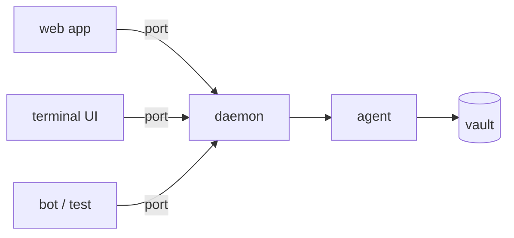

# Daemon API: the view contract

Status: **draft; describes the interface `@estoc/daemon` already exposes and
the changes that make it a contract any view can build on**. This document
owns the boundary between the daemon (the agent and its vault) and a **view**
(anything that shows the vault to a person and asks for things on their
behalf). The first-party web app is one view. A terminal UI, a bot, a test
harness or somebody else's app are others, and they are equal before the
daemon. Vault semantics follow the [version 4 suite](replica-model/README.md);
nothing here changes what the vault records or when. The capitalized
requirement words have their BCP 14 meanings.

<a id="model"></a>

## 1. Model

A **daemon** holds one vault, unlocks its seed, runs the agent and answers
calls. A **view** holds a proxy to a daemon and nothing else. Everything that
crosses between them is a plain record or bytes: no runtime, no key, no
agent, no event. The daemon dictates a **phase** (which screen the person is
owed) and, once open, hands the vault over as a whole **snapshot** after
every commit. A view renders what it was last handed and asks for changes by
name (`send`, `acceptInvitation`, `rotate`); it never composes events.



Two properties are the point of the boundary and MUST hold for every
transport:

- **Nothing secret crosses.** The seed, derived keys, the keystore and raw
  events stay in the daemon. A view gets records, a view gets bytes it asked
  for (a backup), and a view hands over a passphrase, once, to unlock. A view
  written badly can draw the wrong thing; it cannot leak the identity.
- **The daemon is the single reader of the vault.** A view never opens the
  SQLite file, not even read-only. What a view knows, it was told over the
  port.

A view attaches in one of two ways, over the same interface:

| Attachment | Port | Daemon runs | Views at once |
| --- | --- | --- | --- |
| **embedded** | `MessagePort` (structured clone) | in the view's own process or worker | one, the embedder |
| **attached** | WebSocket (text frames, codec) | in a process the view finds | any number, each with the token |

The browser app embeds a daemon in a dedicated worker and MAY instead attach
to a Node daemon (`?_daemon=`). A terminal UI attaches. A view that embeds
takes on the [host contract](#embedding) for the daemon it embeds.

<a id="packages"></a>

## 2. Packages

The contract is the package `@estoc/daemon-api`. It holds:

- every type that crosses the port: the `Daemon` interface, `DaemonEvents`,
  `Snapshot`, `Lines`, the record types they carry and the identifier
  vocabulary those records use;
- the wire: `Port`, the frame shapes of section 3, `encode`/`decode`, and
  `connect()` (a view's proxy) and `serve()` (a daemon's side);
- `API_VERSION` (section 8).

`@estoc/daemon-api` MUST have no runtime dependency and MUST type-check on
its own: a view that depends on it alone compiles. This is what makes the
contract usable outside this repository. The record types now declared in
`@estoc/agent-core` (`ChannelRecord`, `MessageRecord`, `ObservationRecord`,
`ContactRecord`, `InvitationRecord`, `PendingWork`, `Content`, `Connection`,
`WaitingDelivery`, `Discarded`, `TraceLevel`) and the identifiers now declared
in `@estoc/vault` (`Did`, `DidId`, `ContactId`, `MessageId`, `MediationId`,
`ExecutionId`, `EventCid`, `EventReference`, `Channel`, `DisclosureUses`)
move to `@estoc/daemon-api`; `@estoc/vault` and `@estoc/agent-core` import
them from there as types. Re-exporting them from the api package instead
would leave a view needing both packages installed to resolve declarations,
which defeats the purpose.

Every type in the api package MUST survive the codec unchanged: plain
objects, arrays, strings, numbers, booleans, `null`, `Uint8Array` and `Map`.
No class instance, no function, no `Date`, no `undefined` as a value that
matters (a missing optional field and `undefined` are the same thing on the
wire).

`@estoc/daemon` implements the interface and depends on the api package.
`@estoc/app` and every other first-party view depend on the api package and
MUST NOT import `@estoc/daemon`, `@estoc/agent-core` or `@estoc/vault`,
except that the browser app imports `@estoc/daemon` in the worker that embeds
it. The protocol constants a view needs to name a message type
(`BASIC_MESSAGE`, `PROFILE`, `GOAL_CONNECT`) and the invitation link helpers
(`invitationUrl`, `parseInvitation`) move to the api package with the types.

<a id="wire"></a>

## 3. Wire

A port carries messages both ways. Four frame shapes:

```ts
type Wire =
  | { kind: "call"; id: number; method: string; args: unknown[] }
  | { kind: "result"; id: number; value: unknown }
  | { kind: "error"; id: number; message: string; name?: string }
  | { kind: "event"; name: string; args: unknown[] };
```

- A **call** names a method of the `Daemon` interface. `id` is chosen by the
  view and MUST be unique among the view's calls in flight on that port. The
  daemon answers each call with exactly one `result` or `error` carrying the
  same `id`; calls MAY be answered out of order.
- An **error** carries the thrown error's message and, when the error has a
  class name other than `Error`, that name. A view MUST treat `message` as
  text for the person or the log, never as a value to branch on; `name` is
  the field to branch on and the daemon MUST keep names stable within an API
  version. A call to a method the daemon does not have is answered with
  `name: "NoSuchMethod"`.
- An **event** names a member of `DaemonEvents`. Events have no reply.
- A frame the receiver does not read is ignored by the daemon (anything on
  the port that is not a call) and closes the port from a view's side when it
  cannot decode at all (WebSocket close code 1007).

**Structured clone ports** carry values as they are. **Text ports** carry
each frame as one JSON text under the codec: `Uint8Array` as
`{"$bytes": base64}`, `Map` as `{"$map": [[k, v], …]}`, and a plain object of
exactly one key starting with `$` with one more `$` prefixed on the way out
and removed on the way back, so that a message body, which is whatever its
sender wrote, crosses as it was. The codec is total: every value section 2
allows round-trips.

The WebSocket is served by the daemon over plain HTTP on a loopback address
by default. A request is answered only when `Host` names this server (a
loopback name, the bound address, or any address of the machine when bound to
every interface) at the bound port, which is what refuses DNS rebinding. An
upgrade without the token (section 4) is closed with 401 before a frame is
read. HTTP without an app directory to serve answers 426.

<a id="discovery"></a>

## 4. Finding a daemon and getting in

Access is one rule: a socket is answered only with the **token**, presented
as `?token=` on the upgrade URL, whoever asks. The token is minted the first
time a daemon runs on a folder and stays with the folder in
`.estoc/daemon.token` (mode 0600). While a daemon holds the folder it writes
its full socket URL, token included, to `.estoc/daemon.url` (mode 0600) and
removes it when it lets go. A daemon that died leaves the file behind, so it
is word of where to try, not proof anyone listens.

A view on the same machine finds a daemon by the folder: read
`.estoc/daemon.url`, connect, call `hello` (section 5). A view given a URL by
the person (a link the daemon printed, `?_daemon=` for a web page) uses it as
given. A view MUST keep the token out of anything it shows or logs beyond
the link it was given, and MUST NOT write it anywhere but its own private
storage.

The daemon runs one vault per process. There is no method to pick a vault;
the folder the daemon was started on is the vault.

<a id="session"></a>

## 5. Session

`hello(): Promise<{ api: number; daemon: string }>` is the one call a view
makes before anything else. `api` is the `API_VERSION` the daemon speaks
(section 8) and `daemon` names its implementation and version for the log.
The daemon answers `hello` in every phase, including `elsewhere`. A view that
finds `api` outside what it was built for MUST say so to the person and
MUST NOT go on to `boot`.

`boot()` is next. On a daemon not yet up it takes the files and lands on the
phase they dictate; on a daemon already up (an attached view arriving late,
or a second one) it is a **replay** to that view alone: the current `phase`,
and when open, `opened` with the snapshot and `lines`. While a replay reads
the snapshot, live events for that view are held and follow the replay out,
so a view never sees something the snapshot does not hold yet and then has
it taken away. A record the snapshot holds MAY come again as an event.

After `boot`, the daemon speaks in events:

| Event | Means | View does |
| --- | --- | --- |
| `phase(phase, detail)` | which screen the vault dictates; never `open` (that is `opened`) | replace the screen; drop the snapshot it held |
| `opened(snapshot)` | the vault is open, here it is | replace everything derived from a snapshot |
| `changed(snapshot)` | something was committed | the same, whole |
| `lines(lines)` | what only the running agent knows: connections, deliveries waiting, discards | replace |
| `log(line)` | a line for the person's activity log | append |

Phases are `booting`, `elsewhere` (another daemon has the files),
`onboarding` (no vault), `unreadable`, `damaged`, `locked`, `open` and, said
by no daemon, `unreachable`, which an attached view says of itself when
nothing answers. A view MUST render every phase, if only as a line of text;
what each phase owes the person is documented on `Phase` in the api package.

Snapshots are **whole**: the view takes the next one entire and derives what
it shows from it. A view MUST NOT patch the snapshot it holds with what it
expects a call to have done; the vault's own account arrives as the next
`changed`. A view keys what it holds across snapshots by record identity
(`messageId`, `contactId`, the channel pair, `sourceEventCid`), never by
position. Snapshots are not diffs and there is no subscription narrower than
the vault; that is a non-goal of this version.

Calls that change the vault run one at a time in the order asked. A call's
return value is the procedure's own word on what it did (`Outcome`,
`SendResult`, `Merged`); the vault's account of the same thing is in the next
snapshot. `refresh()` asks for the snapshot as of now to every view, for what
changed with no call of a view's (a retry the dispatcher made on its own).

Several attached views at once are ordinary: each gets every event; a call
from one is a change all of them see. The daemon does not tell views apart.

<a id="records"></a>

## 6. Records: what is decided below the port

The rule for where a derivation lives: **if two views disagreeing about it
would make one of them wrong, it is derived in the daemon and handed over as
a record; if they would only look different, it is the view's.** Which name a
peer goes by, which channels form one thread, which conversation inherited
another after a rotation: wrong if views disagree. Whether messages are
grouped by day, what a bubble looks like, how a rail is sorted: taste.

Accordingly the snapshot carries, beside the raw `channels` and `contacts`,
the **conversations** the first-party app derives today:

```ts
interface ConversationRecord {
  /** the contact's ID(s) joined, or the pair a nameless conversation leads to, which moves when its head does */
  key: string;
  contactId: ContactId | null;
  petname: string | null;
  /** what the peer last called itself in a channel shown here: a claim, never a name of ours */
  claimedName: string | null;
  channels: (ChannelRecord & { selected: boolean })[];
  /** the channels a send may go out in, heads of what is shown */
  writeTo: Channel[];
  defaultWriteTo: Channel | null;
  /** the admitted inputs and the outputs of every channel shown, each message once, in the order this vault first recorded them */
  messages: MessageRecord[];
  /** what arrived in a channel shown here and is not admitted, each once */
  unadmitted: ObservationRecord[];
  diagnostics: string[];
}
```

with the derivations as the app has them now, restated so a second
implementation of the daemon makes the same records:

- A **contact's conversation** shows the channels the contact selects, each
  channel record the snapshot's. A channel no contact selects joins a
  **nameless conversation** keyed by its head (the channel itself when it is
  the head); the nameless conversation writes to its head only while the
  head's send gate is open.
- The **thread** is every message of every channel shown, each `messageId`
  once, ordered by `at` (when this vault first recorded it).
- The **claimed name** is the peer's name claim whose claiming message this
  vault recorded last; a message ID says nothing of order and only settles
  two claims recorded at once.
- The **successor** of a conversation a view was showing is the one
  conversation that now shows any of its pairs; none while several do. The
  daemon does not carry this: it is a function of two snapshots, which only
  the view holds, and belongs in the api package as a pure helper
  (`successorOf`).

Message records carry a **summary**: `summary: string | null`, one line of
text the type's handler derives from an available body (a basic message's
content, a profile's "name: …"), `null` for a type no handler knows or a
body not available. A view with no renderer for a type shows the summary; a
view with one ignores it. The summary is the daemon's, so a terminal UI and
the web app say the same thing about the same message without either
knowing the protocol.

Everything else in a view is the view's: drafts, which conversation is open,
scroll positions, the install state of a web page, its own log buffer. A
view keeps these in its own storage, keyed by the vault's `anchor` when they
are per vault.

<a id="views"></a>

## 7. What a view owes

- Call `hello`, then `boot`, then take events; never assume a phase before
  the daemon said it.
- Take snapshots whole; ignore fields it does not know (section 8).
- Branch on `name` in errors and on the words in `Outcome`, never on
  `message` text.
- Show the person every phase and every `Outcome` that was not `submitted`;
  a view that swallows `failed` or `uncertain` misleads.
- Keep the token in its own private storage; keep passphrases nowhere.
- Honour `restoreUnexplained`: while it is set, offer no send and no manual
  dispatch until the person has been shown what a restore cannot bring back,
  then call `explainedRestore`.
- Treat `PendingWork` as work the person is owed a way to do: a view MAY
  choose what to surface first, but MUST surface all of it somewhere.

A view MAY be headless (a bot, a test) and then owes the person nothing to
look at, but the same calls and the same reading of `Outcome`.

<a id="embedding"></a>

## 8. Embedding a daemon

A view that embeds a daemon calls `createDaemon(host, emit)` from
`@estoc/daemon` and speaks to it over an in-process port, or directly by
method. It supplies a `DaemonHost`: where the SQLite files are and how they
are taken as a whole, where the unlocked seed waits between sessions, the
DIDComm library as that runtime loads it, and the transports. The host
contract is documented on `DaemonHost` and `DaemonStorage` in `@estoc/daemon`
and is not repeated here. A Node process answers with a folder, memory,
`@estoc/didcomm-node` and the global fetch; the browser app with the
access-handle pool, IndexedDB and the bundled WASM. An embedding view that
brings a host of its own is responsible for exclusive ownership of the files
(`DatabaseBusy` on a second open) exactly as the [SQLite
vault](replica-model/vault-sqlite.md) requires.

<a id="versioning"></a>

## 9. Versioning

`API_VERSION` is an integer. Within one version:

- a field MAY be added to a record or an event's argument; views MUST ignore
  fields they do not know;
- a method MAY be added; a view calling one the daemon lacks gets
  `NoSuchMethod` and MAY fall back;
- no field is removed or changes meaning, no event is removed, no error name
  changes, and no `Outcome` word changes meaning.

Anything else bumps the version. A daemon speaks exactly one version; a view
states the versions it was built for and refuses the rest at `hello`
(section 5). The codec and the frame shapes of section 3 are part of version
1 and change only with the version.

<a id="reference-views"></a>

## 10. Reference views

`@estoc/app` remains the first-party web view and is brought under this
contract by depending on `@estoc/daemon-api` alone outside its worker.

`@estoc/tui` is the second first-party view and the proof that the contract
suffices: a terminal UI that attaches to a Node daemon by folder (section 4)
and depends on `@estoc/daemon-api` only. It shows every phase, the rail of
conversations, one thread with summaries, pending work, and sends basic
messages. What it cannot do with the records it is given is a defect of this
contract, not of the TUI.

<a id="non-goals"></a>

## 11. Non-goals of this version

- Snapshot diffs or per-conversation subscriptions.
- Tokens with narrower rights than the whole daemon (a read-only view).
- A Unix domain socket transport; loopback TCP with the token suffices.
- Renderers as signed objects or sandboxed code; a renderer is a view's own.
- Running one daemon over several vaults.
