# Continuity illustrated: concepts and test boundaries

Starting from an oriented DID pair, this guide puts test inputs, derivation and
query results side by side. Read the [README](../README.md) and
[public types](../src/model.ts) for the API and integration contract. Test links
point to the fixed source revision used to check these examples.

Start with [both parties rotating and joining](#join), then explore
[contexts](#contexts), [links only the positive graph has](#diagnostic) and
[onward rotations](#onward).

| Notation | Meaning |
| --- | --- |
| `C(A0,B0)` | From A's perspective: A0 is the local DID and B0 is the peer DID. Swapping them changes the question. |
| A0, A1, B0, B1 | DID abbreviations used in the tests. Numbers identify predecessors and successors in an example; they provide no timestamp or ordering authority. |
| `p1` | A `peer-observation` fact whose receipt carried the peer's verified and bound rotation: B1 wrote to A0, having rotated from B0 (`rotatedFrom: "B0"`). |
| `o1` | A `peer-observation` fact whose receipt carried no proof: an authenticated receipt from the peer to an **exact local DID**. |
| `d1` | A `local-decision`: a local rotation or ending decision the host has saved. |
| `e` | An ending: a `peer-ending` fact, the peer's verified and bound ending, or a `local-decision` that ends. |
| Dashed `join` edge | An edge derived from the two sides' rotations. It can be usable without another receipt. |
| Dashed `diagnostic` edge | An edge retained to explain history or ambiguity. It cannot serve as a usable path. |
| `support` | The facts supporting the asserted links or an individual confirmation, not every fact the answer depends on. |

A result lists facts by their content; a fact names no receipt or saved
decision, and facts that say the same thing are one fact. The tables write each
fact's label, as the tests name the variable. Edges are labeled with their
purpose.

## From evidence to queries

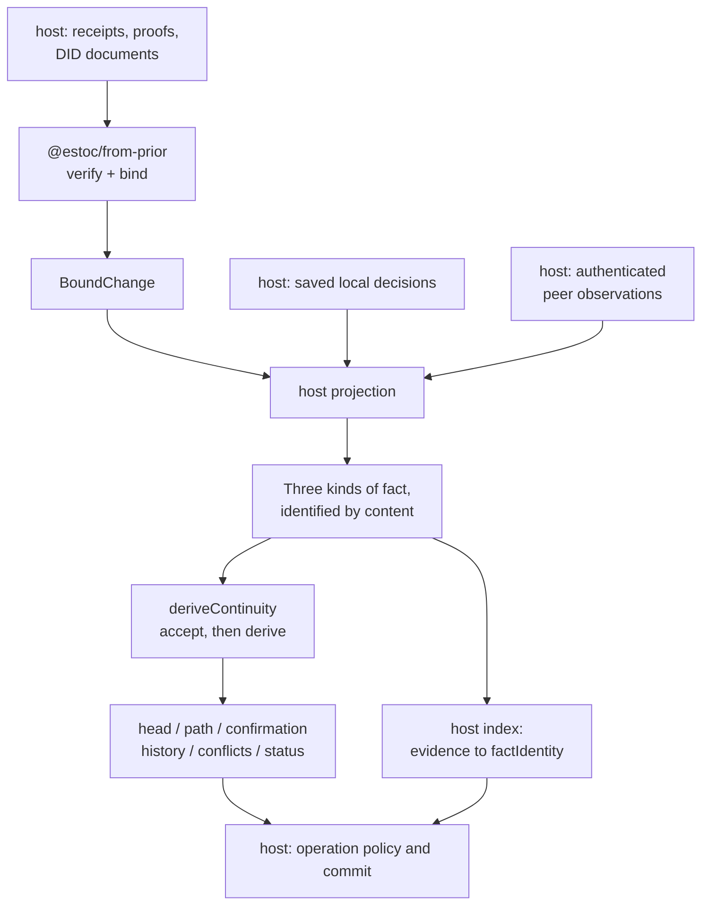

Every fact is the host's projection: of a saved decision, of a receipt that
carried no proof, or of the change `@estoc/from-prior` bound to the receipt that
carried one. A receipt that carried a rotation is one observation that says two
things: how the peer's address continued, and which local address the successor
wrote to. A receipt that carried no proof confirms the exact address it records
and nothing else. Facts are identified by content, so a thousand receipts from
B0 to A0 are one observation; the host keeps the index from each receipt to the
fact it projects, and answers which receipt a fact stands for.

<a id="peer-rotation"></a>

## Receiving a peer rotation: one receipt, two pairs

B1 writes to A0 carrying a B0-to-B1 proof. The host projects one fact, `p1`: an
observation at the new pair whose `rotatedFrom` is B0. It claims the rotation at
the old pair and records the receipt at the new one, so it sits at both.

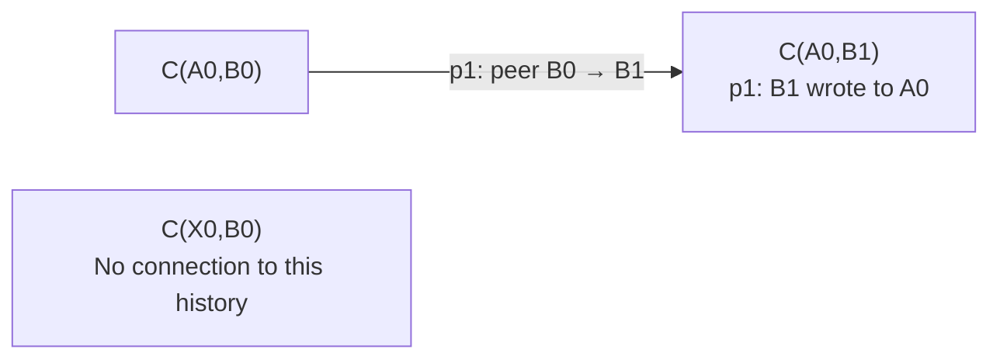

| Query or variation | Result |
| --- | --- |
| `head(C(A0,B0))` | `head C(A0,B1)`, with support `[p1]`. |
| `head(C(A0,B1))` | The queried pair is already the head, with support `[]`. |
| `confirmation(A0,B0)` | `confirmed`, with witness `[p1]` for `p1`. |
| `confirmation(A0,B1)` | `p1` also confirms A0 here, with the same witness. |
| `changes(C(A0,B0), peer)` | `p1`, at the pair the peer left. `changes(C(A0,B1), peer)` lists nothing. |
| Several receipts carry the same proof | One fact, `p1`. A receipt from B1 to A0 without a proof is a second fact beside it. |
| An independent observation exists at `C(X0,B0)` | Its head stays `C(X0,B0)`. Sharing B0 creates no connection to the rotation. |
| No fact mentions a pair | Its head is `no-evidence`. |

**Tests:** [receiving a peer rotation][test-peer], [repeated carriers][test-repeat].

<a id="local-rotation"></a>

## Local rotation needs predecessor confirmation

Saving `d1`, a local A0-to-A1 decision, does not immediately establish a usable
link. An observation must confirm **A0**. It can come from B0 or from a successor
of B0 reached by a usable path of peer rotations.

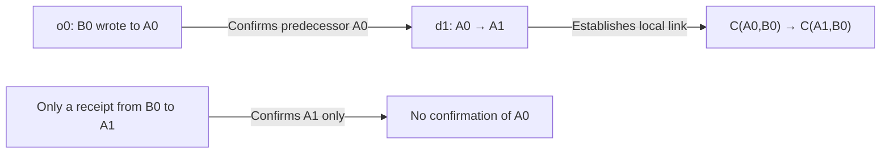

| Input | `status(d1)` | `head(C(A0,B0))` |
| --- | --- | --- |
| Only `d1` | `waiting` | `unresolved`, waiting `[d1]`. |
| Add `o0`, addressed to A0 | `usable` | `head C(A1,B0)`, support `[d1,o0]`. |
| Only an observation addressed to A1 | `waiting` | Still `unresolved`: receipt at the successor does not confirm the predecessor. |
| Instead `p1`, B1's receipt to A0 carrying B0 → B1 | `usable` | `head C(A1,B1)`, support `[d1,p1]`: B1 is a successor of B0 and wrote to A0. |
| The same A0 → A1 saved at `C(A0,B0)` and at `C(A0,B1)`, which `p1` connects | `usable` | Joint support for one change, not a fork. |

A decision names no observation: any usable one addressed to the predecessor
confirms it. A chain of unconfirmed A0-to-A1-to-A2 decisions cannot become
usable just because an observation addresses A2 at its far end.

The declared but unestablished successor `C(A1,B0)` is also `unresolved`.
`FactStatus.waiting` describes an individual fact, while
`HeadResult.unresolved` says the query still has forward choices to account for.

**Tests:** [local rotation and confirmation][test-local].

<a id="join"></a>

## Both parties rotate: a join establishes a pair without inventing a receipt

At the starting pair, `o0` confirms A0. A saves `d1`, an A0-to-A1 decision, and
B1 writes to A0 carrying B0-to-B1, which is `p1`. Once both base edges are
established, the model derives two join edges:

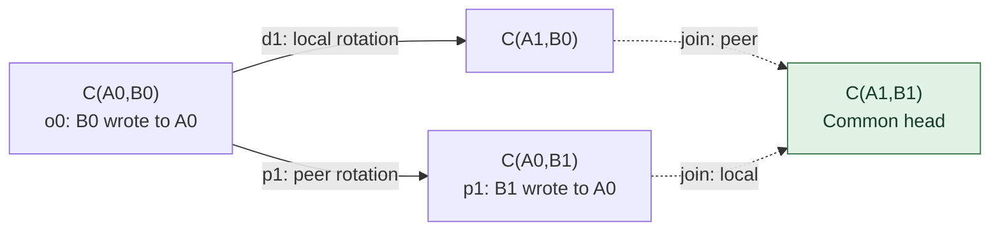

The diamond shows where the two address changes continue together.
**It contains no receipt from B1 to A1, so A1 remains unconfirmed.**

This minimal example uses the public API. A0 and the other strings are the
abbreviations used by the core tests; `@estoc/from-prior` binds only actual
did:peer:4 identifiers.

```ts
import { deriveContinuity, type ContinuityFact } from "@estoc/continuity";

const C = (localDid: string, peerDid: string) => ({ localDid, peerDid });
const facts: ContinuityFact[] = [
  { kind: "peer-observation", at: C("A0", "B0"), rotatedFrom: null },
  { kind: "local-decision", at: C("A0", "B0"), change: { kind: "rotate", successor: "A1" } },
  { kind: "peer-observation", at: C("A0", "B1"), rotatedFrom: "B0" },
];

const model = deriveContinuity(facts);
model.head(C("A0", "B0"));
model.confirmation("A1", "B1");
```

| Query | Result |
| --- | --- |
| `head` from C(A0,B0), C(A1,B0) or C(A0,B1) | All reach `C(A1,B1)`, with support `[d1,o0,p1]`. |
| `confirmation(A0,B0)` | `confirmed` by o0, and by p1 through the B0 → B1 rotation. |
| `confirmation(A1,B1)` or `confirmation(A1,B0)` | `unconfirmed`, with unusable `[]`: there is no observation addressed to A1. |
| The two join edges in `history` | `derived: true` and `usable: true`, each with support `[d1,o0,p1]`. |

A later authenticated, proof-free message from B1 to A1 supplies the missing
observation `o2`:

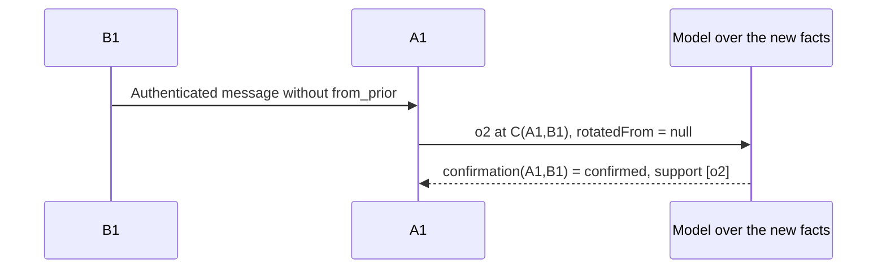

For `confirmation(A1,B0)`, the witness must also establish how B0 reaches B1, so
o2's support is `[d1,o0,o2,p1]`. The same observation can need different complete
witnesses for different query starting points.

**Tests:** [both parties rotate][test-join].

<a id="contexts"></a>

## Contexts establish scope; paths preserve direction

In the join example, `history(C(A0,B0))` has these two contexts:

| Name | Fixed endpoint | Members in this example | Purpose |
| --- | --- | --- | --- |
| `samePeer` | Peer B0 | C(A0,B0), C(A1,B0) | The pairs local rotations connect: where B0's changes apply. |
| `sameLocal` | Local A0 | C(A0,B0), C(A0,B1) | The pairs peer rotations connect: where A0's decisions apply. |

Each context is named by the endpoint it keeps, and follows connectivity
through the other side's links in either direction. A `path` follows usable rotations only in their forward direction.

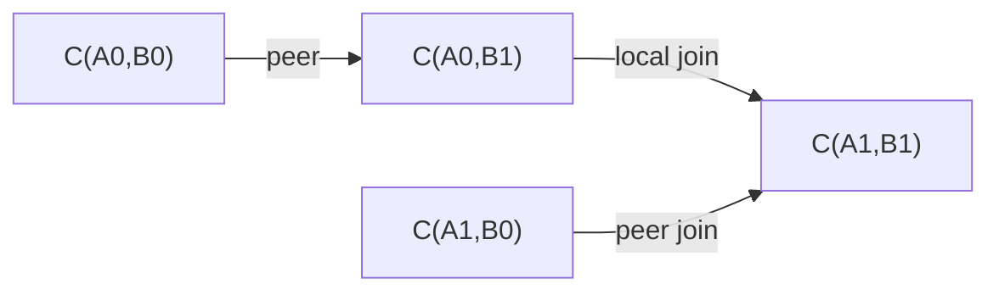

| `path(from, to)` | Result |
| --- | --- |
| C(A0,B0) → C(A1,B1) | This example selects C(A0,B0) → C(A0,B1) → C(A1,B1), with support `[d1,o0,p1]`. |
| C(A1,B1) → C(A0,B0) | `none`: context membership does not let a path reverse rotations. |
| C(A0,B1) → C(A1,B0) | `none`: belonging to the same history does not establish a directed path. |
| Known C(A0,B0) → itself | A zero-step `path`, containing only that channel, with support `[]`. |
| A pair with no evidence → a known pair | `none`. |

The graph's `peer` traversal does not cross local edges; `any` can traverse both
sides. Tests use 1,000 graph edges to check complete reachability, stopping at a
requested target and rebuilding paths on demand. The model also checks heads
and paths over 3,000 peer rotations. These are correctness examples, not
throughput guarantees.

**Tests:** [join paths and contexts][test-join], [graph reach][test-graph],
[long rotation history][test-convergence].

<a id="competition"></a>

## Repetition, competition and structural conflicts

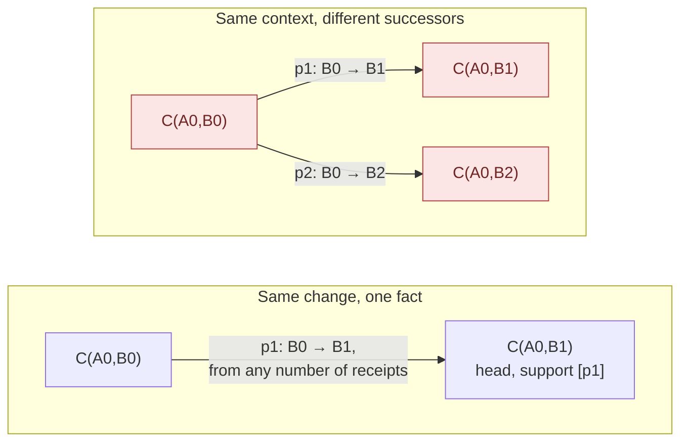

The edges in the "different successors" group are competing claims. `head` and
the affected `path` and `confirmation` queries return `conflict`. Arrival order
and time select no successor.

| Boundary | Result and reason |
| --- | --- |
| Two receipts both carry B0 → B1 to A0 | One fact, with no additional successor or fork. |
| B0 → B1 is carried to A0 and B0 → B2 to A1, and a local link connects C(A0,B0) and C(A1,B0) | Different successors still compete in the same B0 context. |
| Remove that local connection, with no other context connection between the pairs | Sharing B0 alone does not establish this competition across pairs. |
| Save both A0 → A1 and A0 → A2 at one pair, before any observation arrives | Already `competing-changes`: missing confirmation does not erase a saved fork. |
| Add a proof-free observation to a conflicted context | It cannot restore usable continuation through the conflict. |
| Another disconnected relationship also uses B0 | It keeps its own usable head. |

Two other graph shapes prevent an ordinary head:

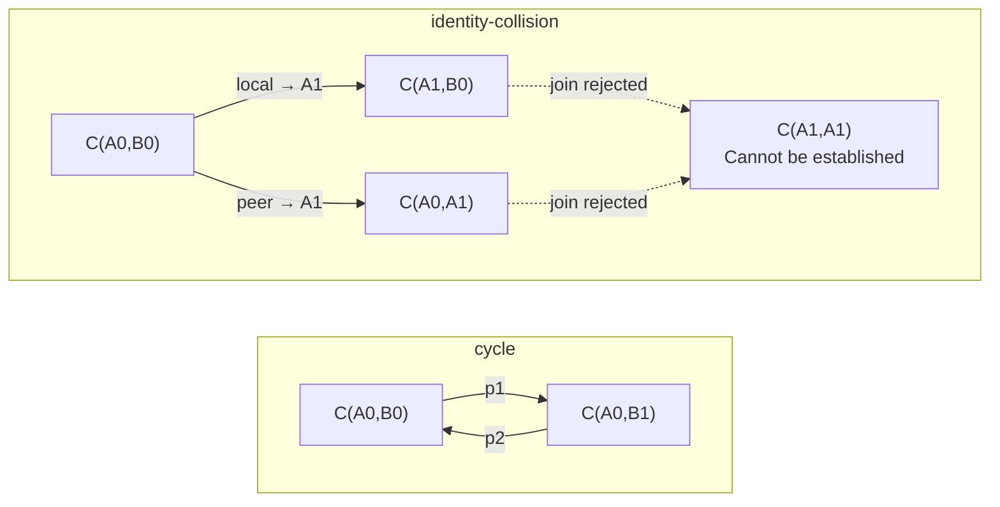

A `cycle` returns to a pair the rotations left. An `identity-collision` would
give both endpoints the same successor DID. These are positive claims; the
resulting conflicts prevent usable paths. The local rotation in the collision
example has predecessor confirmation.

Each conflict carries its scope, the pairs it masks directly: for competing
changes the context and the successor pairs its claims name, for a cycle its
pairs, for a refused join the pair and its two successor pairs. A query that
depends on those pairs may answer `conflict` as well; see
[a link only the positive graph has](#diagnostic).

**Tests:** [repeated carriers][test-repeat], [competing changes][test-competition],
[observations][test-observations].

<a id="acceptance"></a>

## The same facts give the same answers, even when a head is withdrawn

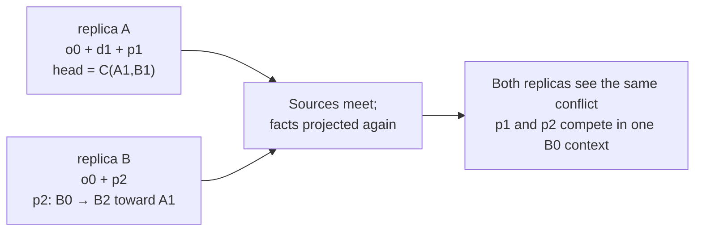

Learning more facts can withdraw a previously usable head. The result still
converges: replicas holding the same facts report the same conflict. Converging
cannot undo messages that have already been sent.

`deriveContinuity` accepts the facts before deriving anything:

| Input boundary | What the tests establish |
| --- | --- |
| The same facts in any order, with any repetition | The same answers. |
| The same content | One fact; object member order is not part of its identity. |
| A receipt with a rotation and one without, at one pair | Two facts: the first also rests on the pair the peer left. |
| Different string case | Another fact; the core does not normalize DIDs for the host. |
| Order of the accepted facts | By identity, the RFC 8785 text, in UTF-8 byte order rather than UTF-16 or locale order. |
| Unknown own enumerable members, required members missing from the object itself, equal endpoints, or a successor or predecessor equal to either endpoint | `InvalidFact`. |
| Missing or incorrectly typed `rotatedFrom` or `change`, an ending with a successor, or invalid Unicode | `InvalidFact`; a required explicit null cannot be omitted. |
| An input member is an accessor | Validation captures its value instead of reading a changing member again later. |
| `factIdentity` or `status` of a value the profile refuses | `InvalidFact`, the same refusal `deriveContinuity` gives. |

An invalid fact rejects the whole call; nothing is derived that skips it.

**Tests:** [accepting facts][test-accept], [the identity of a fact][test-identity],
[validating a fact][test-validate], [convergence and monotonicity][test-convergence].

<a id="diagnostic"></a>

## A link only the positive graph has

A conflict takes every pair its scope reaches out of usable continuity, and with
them what depends on those pairs, even beyond the scope. Here a peer fork at
C(A0,Bz) reaches C(A0,Bp). `s` is B0's receipt to A0 carrying B0's rotation
from Bp: it sits at C(A0,Bp), which the fork reaches, so it is not usable. The
local rotation `d` decides A0 → A1 at C(A0,B0), and nothing but `s` confirms A0
there: `d` links C(A0,B0) to C(A1,B0) in positive history, never in usable
continuity, though neither of its pairs is in conflict.

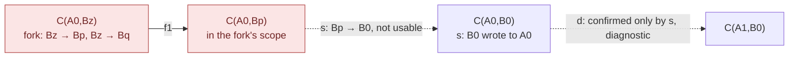

Every rotation the peer makes is observed at its successor pair, addressed to
the same local DID, so any usable peer link leaving C(A0,B0) would confirm A0
for `d`. A pair shares the context of C(A0,B0) without lying ahead of it only
through joins. Below, X0 became A0 at C(X0,B0) and at C(X0,B1), and the peer
moved from B0 and from B1 to B2 toward X0: the joins carry both moves to A0, so
C(A0,B0) and C(A0,B1) both lead to C(A0,B2). `i` decides A0 → A1 at C(A0,B1),
confirmed by B1's receipt to A0 there, which does not lie ahead of C(A0,B0).

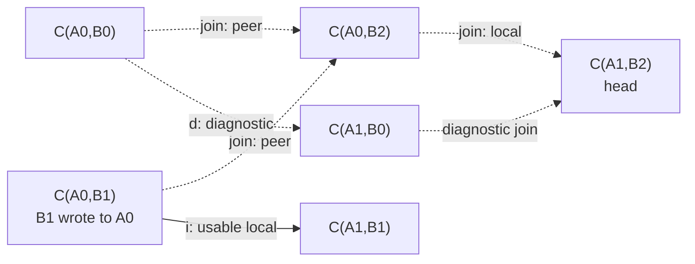

| Situation | Result |
| --- | --- |
| Only d makes A0 → A1 | `head(C(A0,B0))` is `conflict`, facts `[d,s]`. There is no usable path and no fallback to the predecessor head. |
| `i` makes the same A0 → A1 usably at C(A0,B1), in the same usable context | `head C(A1,B2)` along C(A0,B0) → C(A0,B2) → C(A1,B2); d is provenance, and `status(d)` is `waiting`: only continuity that is not usable confirms A0 for it. |
| d without `s`, so nothing confirms A0 for it | The same head: a waiting claim of a change usable links make anyway does not block it. |
| d without `s` and without `i` | `unresolved`, waiting `[d]`. |

Support in `history().links` is positive provenance. Even when a link has
`usable: true`, its history support can contain facts that are not usable. For a
usable witness, read the corresponding `path`, `head` or `confirmation` result.

**Tests:** [the same change elsewhere in a context][test-covered],
[a rotation and a plain observation at one pair][test-observations].

<a id="onward"></a>

## Onward rotations on a side branch still need an answer

Here is a harder boundary. Over the previous section's facts, `i` and the joins
establish a usable route from C(A0,B0) to C(A1,B2), and `d` leaves a side branch
through C(A1,B0) in positive history. `w` saves A1 → A2 on that branch.

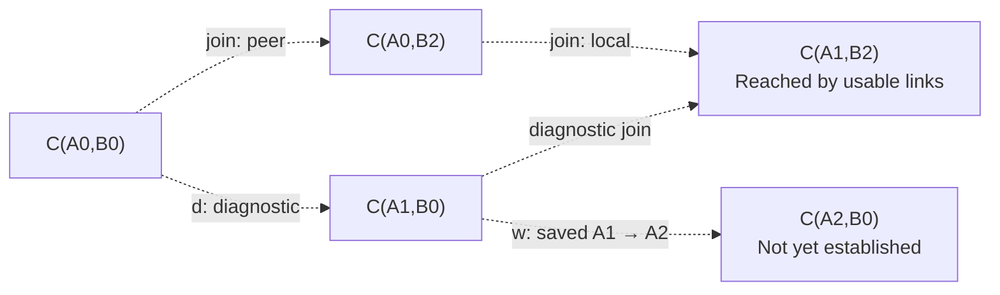

w is outside the usable forward path, but it still declares an onward choice
for A1. The query must account for that choice before returning a head.

| Evidence added to the base example | `head(C(A0,B0))` | Why |
| --- | --- | --- |
| w has not been added | `head C(A1,B2)` | Usable evidence establishes the same change as d. |
| Add w as shown | `conflict`, facts `[w]` | Only diagnostic history connects w's pair to the query; `status(w)` itself is `waiting`. |
| Save the same A1 → A2 at C(A1,B2) instead | `unresolved`, waiting that decision | Usable links connect it; nothing confirms A1 there yet. |
| Add `scope`, B2's receipt to A1 carrying B0 → B2 | `head C(A2,B2)` | It connects C(A1,B0) usably, and as an observation addressed to A1 it confirms w. |
| Without `scope`, establish A1 → A2 at C(A1,B2) with a new observation | `head C(A2,B2)` | The same onward change has usable support; w remains provenance. |
| Instead save A1 → A3 at C(A1,B2) | `conflict` | It competes with w's A1 → A2. |
| Instead of w, end A1 at C(A1,B0) | `conflict`, facts `[the ending]` | Only diagnostic history connects the ending to the query. |

This explains why `status(fact)` and `head(pair)` can return different statuses.
The former describes the fact's own prerequisites; the latter also accounts for
ambiguity in how the claim applies to the queried continuity.

**Tests:** [the same change elsewhere in a context][test-covered],
[saved onward rotation][test-onward].

<a id="ending"></a>

## Endings terminate a context without creating an empty pair

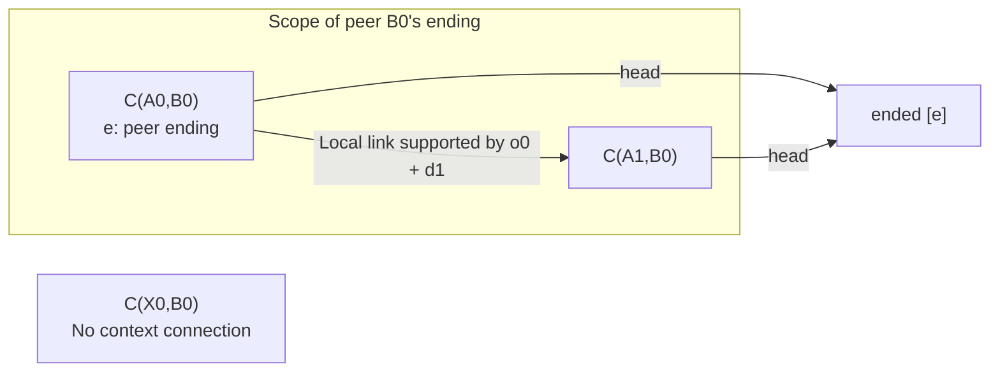

A peer ending applies across its same-peer context, the pairs local rotations
connect while keeping that peer. A local ending applies across its same-local
context. Other pairs with no connecting evidence are unaffected.

| Combination | Result |
| --- | --- |
| B0 ending and B0 → B1 in the same B0 context | `conflict`: incompatible choices for the same side. |
| B0 → B1, followed by B1 ending | `ended`: ordinary forward history at different predecessors. |
| Local A0 ending and peer B0 → B1 | Both pairs are `ended`; there is no continuing joined head. |
| Local ending and A0 → A1 in the same A0 context | `conflict`. |
| Endings of one side at several pairs of a context, or endings of both sides | `ended`, listing every one. |
| A saved A0 → A1 still waiting, and a peer ending at the same pair | `ended`; the decision stays `waiting`. |
| An ending at another pair connects only through a link that is not usable, such as one leaving a pair a fork reaches | The query reports `conflict`; historical connectivity alone cannot apply the ending. |
| The same link without the fork, or another ending of the same side at the queried pair | `ended`. |

For known forward choices, the result accounts for relevant conflicts first,
then established endings, unresolved choices and finally a usable head.
`no-evidence` is reserved for an unknown pair.

Endings retain the original pair and assertion. They create no `C(A,null)` and
do not mean a contact was deleted, a peer was blocked or an application message
was processed. `ended.endings` lists the endings without the complete context
witness across pairs.

**Tests:** [ending][test-ending], [usable scope for an ending][test-ending-scope].

<a id="support"></a>

## A short link can need a witness spanning several hops

p2 is B2's receipt to A0 carrying B1 → B2. For it to confirm A0 in B0's
context, its witness also needs p1, the B0 → B1 step.

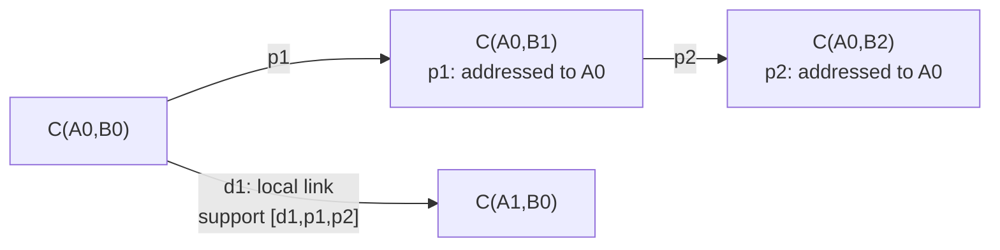

`confirmation(A0,B0)` lists p1 with the witness `[p1]` and p2 with `[p1,p2]`.
d1's link carries every such witness. Keeping only d1 and p2 loses p1, the step
that lets B2 confirm A0 in B0's context. A usable witness includes the required
peer path and the recursive prerequisites of its links. Support need not be a
minimal set.

| Returned evidence | What it establishes |
| --- | --- |
| `path.support` | Re-derives the asserted usable links under the same profile. |
| Each `confirmation.observations[n].support` | Re-derives that individual confirmation: the observation and the peer path to it. |
| `head.support` | Supports the usable links leading to the head; it does not promise to replay the whole query verdict. |
| An unchanged head or zero-step path, with support `[]` | There is no rotation link to prove; this establishes no peer observation. |
| Positive provenance in `history` | Explains origins and ambiguity; it is not a general usable witness. |

Keep the facts and the profile to replay a query result. Support proves no
absence of conflicts outside those facts. `path` selects one deterministic
path. `confirmation` lists eligible observations with one complete witness
each; it does not enumerate every alternative route to the same observation.

**Tests:** [confirmation support across several hops][test-support],
[join witnesses and zero-step paths][test-join]. The complete replay boundary
is in the [README's query explanation](../README.md#what-the-answers-mean).

<a id="host"></a>

## Queries and commits must use a valid revision

This is an integration requirement from the [host contract](../README.md#host-contract).
Core tests demonstrate that new facts can change an answer. The core has
no database transaction and cannot validate the atomicity of a host's commit.

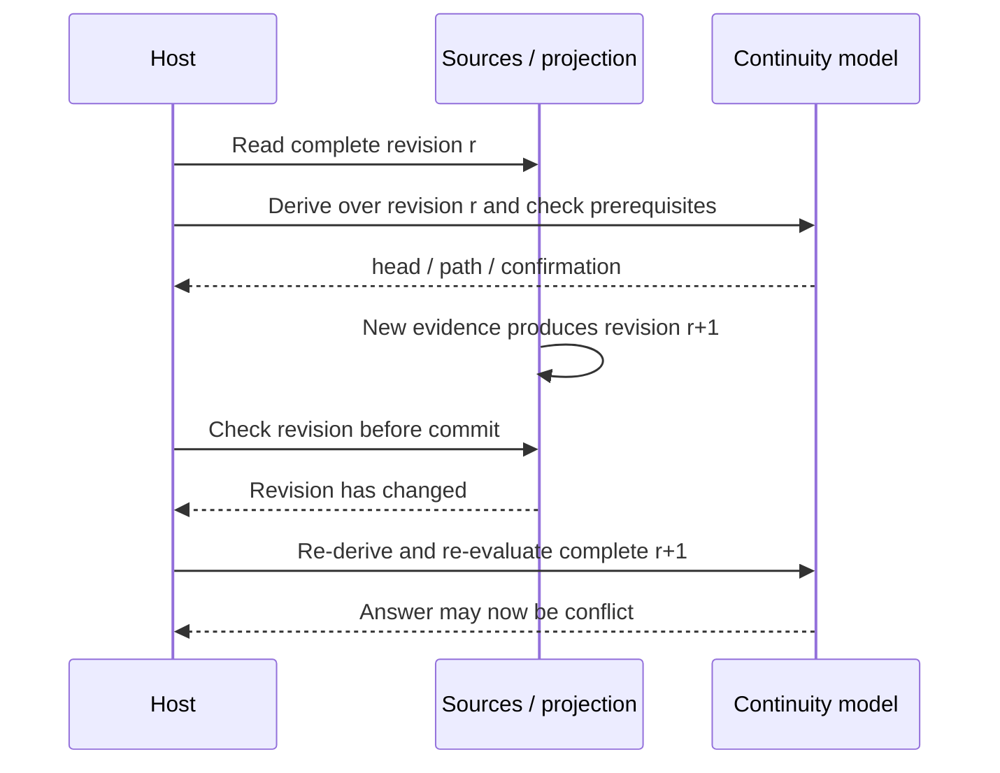

Validation and the state commit must use the same valid revision. The host can
use a transaction, lock or optimistic version check. Projection completeness,
commit consistency and successor-allocation coordination across replicas each
have their own role: a local lock cannot prevent another offline replica from
saving a different successor.

Head, path and confirmation also do not decide key, route, block, admission or
ACK policy. Those decisions remain with the host that uses the results.

## Find the corresponding tests

| Question | Illustrated section | Test coverage |
| --- | --- | --- |
| How do address changes differ from address confirmation? | [Peer rotation](#peer-rotation), [local rotation](#local-rotation), [join](#join) | Receiving a peer rotation; local rotation and confirmation; both parties rotate. |
| Where can a path go, and which pairs share a scope? | [Contexts](#contexts), [support](#support) | Graph reach; join paths and history; witnesses spanning several hops. |
| When is there no longer a unique head? | [Competition](#competition), [links only the positive graph has](#diagnostic), [onward rotations](#onward) | Competing changes; observations; the head across a context. |
| Why does an ending take precedence over a waiting choice, and a conflict over an ending? | [Endings](#ending) | Ending; the head across a context. |
| Which facts are one fact, and how can replicas converge to a conflict? | [Acceptance](#acceptance) | Accepting facts; the identity of a fact; validating a fact; convergence and monotonicity. |
| Which inputs are rejected between a token and a fact? | The [`@estoc/from-prior` guide](../../from-prior/docs/guide.md) | Inspect; precheck; verify; bind; create. |

[test-peer]: https://github.com/estoc-dev/estoc/blob/1a3985a283148b3e11f772e825a6b5100f62c826/packages/continuity/test/model.test.ts#L39
[test-repeat]: https://github.com/estoc-dev/estoc/blob/1a3985a283148b3e11f772e825a6b5100f62c826/packages/continuity/test/model.test.ts#L74
[test-local]: https://github.com/estoc-dev/estoc/blob/1a3985a283148b3e11f772e825a6b5100f62c826/packages/continuity/test/model.test.ts#L86
[test-support]: https://github.com/estoc-dev/estoc/blob/1a3985a283148b3e11f772e825a6b5100f62c826/packages/continuity/test/model.test.ts#L132
[test-join]: https://github.com/estoc-dev/estoc/blob/1a3985a283148b3e11f772e825a6b5100f62c826/packages/continuity/test/model.test.ts#L145
[test-competition]: https://github.com/estoc-dev/estoc/blob/1a3985a283148b3e11f772e825a6b5100f62c826/packages/continuity/test/model.test.ts#L197
[test-ending]: https://github.com/estoc-dev/estoc/blob/1a3985a283148b3e11f772e825a6b5100f62c826/packages/continuity/test/model.test.ts#L279
[test-observations]: https://github.com/estoc-dev/estoc/blob/1a3985a283148b3e11f772e825a6b5100f62c826/packages/continuity/test/model.test.ts#L345
[test-ending-scope]: https://github.com/estoc-dev/estoc/blob/1a3985a283148b3e11f772e825a6b5100f62c826/packages/continuity/test/model.test.ts#L400
[test-covered]: https://github.com/estoc-dev/estoc/blob/1a3985a283148b3e11f772e825a6b5100f62c826/packages/continuity/test/model.test.ts#L419
[test-onward]: https://github.com/estoc-dev/estoc/blob/1a3985a283148b3e11f772e825a6b5100f62c826/packages/continuity/test/model.test.ts#L437
[test-convergence]: https://github.com/estoc-dev/estoc/blob/1a3985a283148b3e11f772e825a6b5100f62c826/packages/continuity/test/model.test.ts#L461
[test-graph]: https://github.com/estoc-dev/estoc/blob/1a3985a283148b3e11f772e825a6b5100f62c826/packages/continuity/test/graph.test.ts#L6
[test-accept]: https://github.com/estoc-dev/estoc/blob/1a3985a283148b3e11f772e825a6b5100f62c826/packages/continuity/test/accept.test.ts#L13
[test-identity]: https://github.com/estoc-dev/estoc/blob/1a3985a283148b3e11f772e825a6b5100f62c826/packages/continuity/test/accept.test.ts#L57
[test-validate]: https://github.com/estoc-dev/estoc/blob/1a3985a283148b3e11f772e825a6b5100f62c826/packages/continuity/test/accept.test.ts#L74
