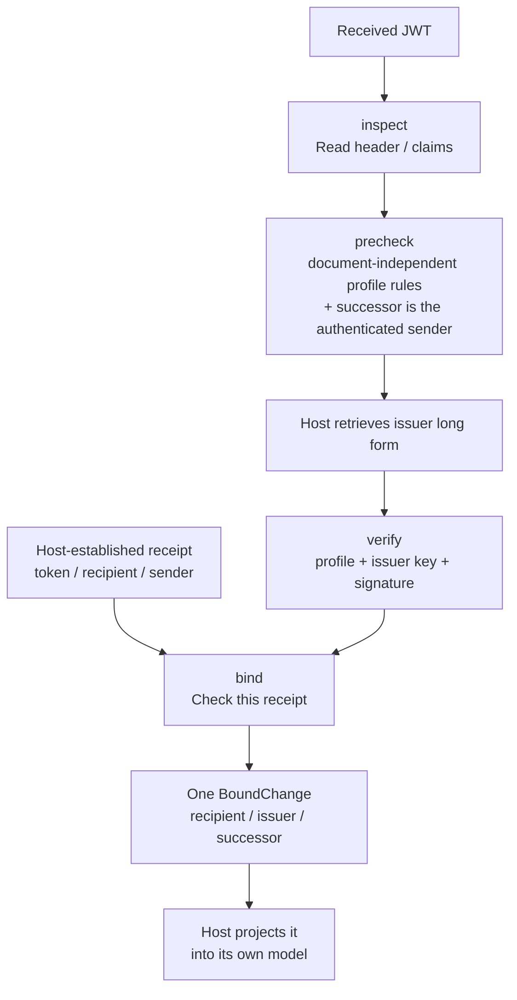
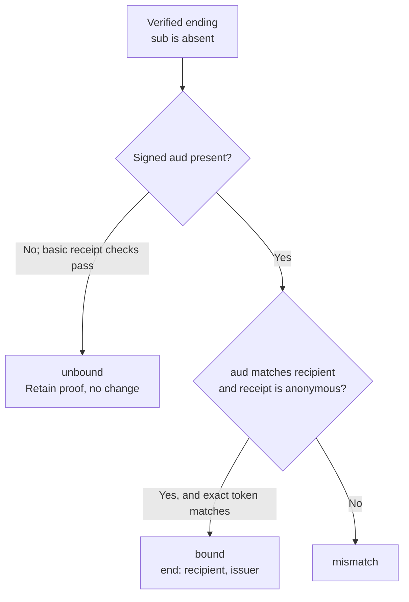
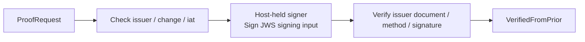

# from_prior illustrated: processing stages and test boundaries

This guide puts the inputs the tests exercise beside what each stage of
proof processing decides. Read the [README](../README.md) and the
[public types](../src/index.ts) for the API and the host contract. Test links
point to the fixed source revision used to check these examples.

Inspect, precheck, verify and bind are separate stages, and only binding
relates a proof to a receipt. What a bound proof establishes is a
`BoundChange` in short-form DIDs: a rotation says the successor wrote to the
recipient, having rotated from the issuer; an ending says the issuer ended
what it had with the recipient. The host projects that change into its own
model, as it does with every other piece of evidence it keeps.

## Inspect, precheck, verify and bind are separate proof-processing stages

`inspect` can successfully read a token whose signature has been tampered with.
`precheck` refuses, before the host has any issuer material, what the profile
can already decide: the algorithm, media type and critical headers, the DIDs,
the shape of the change and, given the authenticated sender, a rotation whose
successor is someone else; what it passes is still unverified, and a host that
lacks the issuer's material waits rather than rejects. `verify` applies the
same rules again, takes the authorized key from the issuer's own long-form DID
and verifies the signature. `bind` checks the exact token against the receipt
and reports a change only when binding succeeds.

| Input boundary exercised by the tests | Result |
| --- | --- |
| Wrong JWT segment count or JSON shape, non-integer `iat`, `sub: null`, or array-valued `aud` | `form` failure. |
| A signature segment that is not base64url or not 64 bytes long | `form` failure at inspection, precheck and verification; a well-formed wrong signature is left to verification. |
| `exp` or `nbf` | Rejected: this profile evaluates no validity window, and verification reads no clock. |
| Unsupported DID method or algorithm, rotation to the issuer itself, or a rotation with an audience | `profile` failure. |
| Absent `typ`, or case variants of JWT / application/jwt | Accepted; extra whitespace, parameters and other media types are rejected. |
| Absent `b64`, or `true` with `b64` listed in `crit` | Accepted; `false`, wrong types and missing required critical-header declarations are rejected. |
| Unknown critical extension | `profile` failure at the precheck and at verification; inspection still reads the token. |
| `crit` naming a `b64` the header lacks, or listing a header twice | `form` failure at every stage. |
| An authorized JWK whose `x` is not a 32-byte Ed25519 key | `document` failure, the same as a Multikey of another type. |
| A rotation whose successor is not the authenticated sender the precheck was given | `binding` failure before any issuer material; an ending is left to `bind`. |
| A tampered signature | Passes the precheck without a verified type; `signature` failure at verification. |
| Repeated JSON claim name | The parser's last value is used; inspection and interpretation of the verified payload agree. |
| Short-form `iss` and `kid` with the matching retained long form | Accepted; presented spellings and canonical short forms are both retained. |
| Wrong, malformed or hash-mismatched issuer long form, or a key not authorized for authentication | `document` failure; a caller-assembled document cannot substitute another key. |
| A qualifying Multikey, JWK or embedded authentication method | Can verify an Ed25519 signature; a key authorized only for keyAgreement cannot. |
| Altered signed payload, another signing key or incorrect signature bytes | `signature` failure. |
| A different receipt token, a sender other than the rotation successor, or an ineligible recipient | Binding `mismatch`, reporting no change. |
| A rotation bound to its receipt | `rotate`, with the recipient, `iss` as the issuer and `sub` as the successor, each in short form; a bound ending reports `end` with the recipient and `iss`. |

## A verified ending can still be unbound

`sender: null` is the host's assertion of an anonymous receipt, requiring the
plaintext to contain no `from`. Signed audience is an extension of this
package's profile. A valid basic ending token alone does not identify which
recipient's relationship it ends. An anonymous receipt authenticates no
sender, so a bound ending says nothing about who wrote to the recipient.

## Creation verifies the signer's output too

An inconsistent issuer, change or `iat` is rejected before signing. An
unauthorized method, another key or invalid signature bytes cannot produce
a verified proof. The signer can hold a non-exportable key. Creating a
proof saves no decision and sends no message.

**Tests:** [inspect][test-inspect], [precheck][test-precheck],
[verify][test-verify], [bind][test-bind], [create][test-create].

[test-inspect]: https://github.com/estoc-dev/estoc/blob/8c9f1609e106331e81ae36eea624920331eaf555/packages/from-prior/test/from-prior.test.ts#L75
[test-precheck]: https://github.com/estoc-dev/estoc/blob/8c9f1609e106331e81ae36eea624920331eaf555/packages/from-prior/test/from-prior.test.ts#L104
[test-verify]: https://github.com/estoc-dev/estoc/blob/8c9f1609e106331e81ae36eea624920331eaf555/packages/from-prior/test/from-prior.test.ts#L194
[test-bind]: https://github.com/estoc-dev/estoc/blob/8c9f1609e106331e81ae36eea624920331eaf555/packages/from-prior/test/from-prior.test.ts#L353
[test-create]: https://github.com/estoc-dev/estoc/blob/8c9f1609e106331e81ae36eea624920331eaf555/packages/from-prior/test/from-prior.test.ts#L391
